lez04: Regressioni lineari
================

-   [Riprendiamo il database "iris"](#riprendiamo-il-database-iris)
-   [`summary()`](#summary)
-   [La deviazione standard](#la-deviazione-standard)
-   [Gli indici di dispersione](#gli-indici-di-dispersione)
-   [I nostri dati:](#i-nostri-dati)
-   [Le medie](#le-medie)
-   [Calcolare la media per gruppi:](#calcolare-la-media-per-gruppi)
-   [Calcolare la deviazione standard](#calcolare-la-deviazione-standard)
-   [Una parentesi sull'operatore `%>%` (piping)](#una-parentesi-sulloperatore-piping)
-   [La meccanica interna](#la-meccanica-interna)
-   [La correlazione](#la-correlazione)
    -   [Un'occhiata ai dati](#unocchiata-ai-dati)
    -   [Un'occhiata ai dati](#unocchiata-ai-dati-1)
    -   [Un po' di colore](#un-po-di-colore)
    -   [In dettaglio](#in-dettaglio)
    -   [Correlazione](#correlazione)
-   [Un coefficiente di correlazione 0 non indica variabili indipendenti](#un-coefficiente-di-correlazione-0-non-indica-variabili-indipendenti)
    -   [Il DATASAURO](#il-datasauro)
-   [Regressioni lineari](#regressioni-lineari)
    -   [La regressione lineare](#la-regressione-lineare)
    -   [Il modello lineare minimo](#il-modello-lineare-minimo)
    -   [Anscombe's quartet](#anscombes-quartet)

**NB: il seguente file è derivato dalle slides utilizzate per la lezione, le note e le spiegazioni esaustive riguardo la parte grafica saranno aggiunte il prima possibile.**

Riprendiamo il database "iris"
------------------------------

``` r
iris
```

    ##     Sepal.Length Sepal.Width Petal.Length Petal.Width    Species
    ## 1            5.1         3.5          1.4         0.2     setosa
    ## 2            4.9         3.0          1.4         0.2     setosa
    ## 3            4.7         3.2          1.3         0.2     setosa
    ## 4            4.6         3.1          1.5         0.2     setosa
    ## 5            5.0         3.6          1.4         0.2     setosa
    ## 6            5.4         3.9          1.7         0.4     setosa
    ## 7            4.6         3.4          1.4         0.3     setosa
    ## 8            5.0         3.4          1.5         0.2     setosa
    ## 9            4.4         2.9          1.4         0.2     setosa
    ## 10           4.9         3.1          1.5         0.1     setosa
    ## 11           5.4         3.7          1.5         0.2     setosa
    ## 12           4.8         3.4          1.6         0.2     setosa
    ## 13           4.8         3.0          1.4         0.1     setosa
    ## 14           4.3         3.0          1.1         0.1     setosa
    ## 15           5.8         4.0          1.2         0.2     setosa
    ## 16           5.7         4.4          1.5         0.4     setosa
    ## 17           5.4         3.9          1.3         0.4     setosa
    ## 18           5.1         3.5          1.4         0.3     setosa
    ## 19           5.7         3.8          1.7         0.3     setosa
    ## 20           5.1         3.8          1.5         0.3     setosa
    ## 21           5.4         3.4          1.7         0.2     setosa
    ## 22           5.1         3.7          1.5         0.4     setosa
    ## 23           4.6         3.6          1.0         0.2     setosa
    ## 24           5.1         3.3          1.7         0.5     setosa
    ## 25           4.8         3.4          1.9         0.2     setosa
    ## 26           5.0         3.0          1.6         0.2     setosa
    ## 27           5.0         3.4          1.6         0.4     setosa
    ## 28           5.2         3.5          1.5         0.2     setosa
    ## 29           5.2         3.4          1.4         0.2     setosa
    ## 30           4.7         3.2          1.6         0.2     setosa
    ## 31           4.8         3.1          1.6         0.2     setosa
    ## 32           5.4         3.4          1.5         0.4     setosa
    ## 33           5.2         4.1          1.5         0.1     setosa
    ## 34           5.5         4.2          1.4         0.2     setosa
    ## 35           4.9         3.1          1.5         0.2     setosa
    ## 36           5.0         3.2          1.2         0.2     setosa
    ## 37           5.5         3.5          1.3         0.2     setosa
    ## 38           4.9         3.6          1.4         0.1     setosa
    ## 39           4.4         3.0          1.3         0.2     setosa
    ## 40           5.1         3.4          1.5         0.2     setosa
    ## 41           5.0         3.5          1.3         0.3     setosa
    ## 42           4.5         2.3          1.3         0.3     setosa
    ## 43           4.4         3.2          1.3         0.2     setosa
    ## 44           5.0         3.5          1.6         0.6     setosa
    ## 45           5.1         3.8          1.9         0.4     setosa
    ## 46           4.8         3.0          1.4         0.3     setosa
    ## 47           5.1         3.8          1.6         0.2     setosa
    ## 48           4.6         3.2          1.4         0.2     setosa
    ## 49           5.3         3.7          1.5         0.2     setosa
    ## 50           5.0         3.3          1.4         0.2     setosa
    ## 51           7.0         3.2          4.7         1.4 versicolor
    ## 52           6.4         3.2          4.5         1.5 versicolor
    ## 53           6.9         3.1          4.9         1.5 versicolor
    ## 54           5.5         2.3          4.0         1.3 versicolor
    ## 55           6.5         2.8          4.6         1.5 versicolor
    ## 56           5.7         2.8          4.5         1.3 versicolor
    ## 57           6.3         3.3          4.7         1.6 versicolor
    ## 58           4.9         2.4          3.3         1.0 versicolor
    ## 59           6.6         2.9          4.6         1.3 versicolor
    ## 60           5.2         2.7          3.9         1.4 versicolor
    ## 61           5.0         2.0          3.5         1.0 versicolor
    ## 62           5.9         3.0          4.2         1.5 versicolor
    ## 63           6.0         2.2          4.0         1.0 versicolor
    ## 64           6.1         2.9          4.7         1.4 versicolor
    ## 65           5.6         2.9          3.6         1.3 versicolor
    ## 66           6.7         3.1          4.4         1.4 versicolor
    ## 67           5.6         3.0          4.5         1.5 versicolor
    ## 68           5.8         2.7          4.1         1.0 versicolor
    ## 69           6.2         2.2          4.5         1.5 versicolor
    ## 70           5.6         2.5          3.9         1.1 versicolor
    ## 71           5.9         3.2          4.8         1.8 versicolor
    ## 72           6.1         2.8          4.0         1.3 versicolor
    ## 73           6.3         2.5          4.9         1.5 versicolor
    ## 74           6.1         2.8          4.7         1.2 versicolor
    ## 75           6.4         2.9          4.3         1.3 versicolor
    ## 76           6.6         3.0          4.4         1.4 versicolor
    ## 77           6.8         2.8          4.8         1.4 versicolor
    ## 78           6.7         3.0          5.0         1.7 versicolor
    ## 79           6.0         2.9          4.5         1.5 versicolor
    ## 80           5.7         2.6          3.5         1.0 versicolor
    ## 81           5.5         2.4          3.8         1.1 versicolor
    ## 82           5.5         2.4          3.7         1.0 versicolor
    ## 83           5.8         2.7          3.9         1.2 versicolor
    ## 84           6.0         2.7          5.1         1.6 versicolor
    ## 85           5.4         3.0          4.5         1.5 versicolor
    ## 86           6.0         3.4          4.5         1.6 versicolor
    ## 87           6.7         3.1          4.7         1.5 versicolor
    ## 88           6.3         2.3          4.4         1.3 versicolor
    ## 89           5.6         3.0          4.1         1.3 versicolor
    ## 90           5.5         2.5          4.0         1.3 versicolor
    ## 91           5.5         2.6          4.4         1.2 versicolor
    ## 92           6.1         3.0          4.6         1.4 versicolor
    ## 93           5.8         2.6          4.0         1.2 versicolor
    ## 94           5.0         2.3          3.3         1.0 versicolor
    ## 95           5.6         2.7          4.2         1.3 versicolor
    ## 96           5.7         3.0          4.2         1.2 versicolor
    ## 97           5.7         2.9          4.2         1.3 versicolor
    ## 98           6.2         2.9          4.3         1.3 versicolor
    ## 99           5.1         2.5          3.0         1.1 versicolor
    ## 100          5.7         2.8          4.1         1.3 versicolor
    ## 101          6.3         3.3          6.0         2.5  virginica
    ## 102          5.8         2.7          5.1         1.9  virginica
    ## 103          7.1         3.0          5.9         2.1  virginica
    ## 104          6.3         2.9          5.6         1.8  virginica
    ## 105          6.5         3.0          5.8         2.2  virginica
    ## 106          7.6         3.0          6.6         2.1  virginica
    ## 107          4.9         2.5          4.5         1.7  virginica
    ## 108          7.3         2.9          6.3         1.8  virginica
    ## 109          6.7         2.5          5.8         1.8  virginica
    ## 110          7.2         3.6          6.1         2.5  virginica
    ## 111          6.5         3.2          5.1         2.0  virginica
    ## 112          6.4         2.7          5.3         1.9  virginica
    ## 113          6.8         3.0          5.5         2.1  virginica
    ## 114          5.7         2.5          5.0         2.0  virginica
    ## 115          5.8         2.8          5.1         2.4  virginica
    ## 116          6.4         3.2          5.3         2.3  virginica
    ## 117          6.5         3.0          5.5         1.8  virginica
    ## 118          7.7         3.8          6.7         2.2  virginica
    ## 119          7.7         2.6          6.9         2.3  virginica
    ## 120          6.0         2.2          5.0         1.5  virginica
    ## 121          6.9         3.2          5.7         2.3  virginica
    ## 122          5.6         2.8          4.9         2.0  virginica
    ## 123          7.7         2.8          6.7         2.0  virginica
    ## 124          6.3         2.7          4.9         1.8  virginica
    ## 125          6.7         3.3          5.7         2.1  virginica
    ## 126          7.2         3.2          6.0         1.8  virginica
    ## 127          6.2         2.8          4.8         1.8  virginica
    ## 128          6.1         3.0          4.9         1.8  virginica
    ## 129          6.4         2.8          5.6         2.1  virginica
    ## 130          7.2         3.0          5.8         1.6  virginica
    ## 131          7.4         2.8          6.1         1.9  virginica
    ## 132          7.9         3.8          6.4         2.0  virginica
    ## 133          6.4         2.8          5.6         2.2  virginica
    ## 134          6.3         2.8          5.1         1.5  virginica
    ## 135          6.1         2.6          5.6         1.4  virginica
    ## 136          7.7         3.0          6.1         2.3  virginica
    ## 137          6.3         3.4          5.6         2.4  virginica
    ## 138          6.4         3.1          5.5         1.8  virginica
    ## 139          6.0         3.0          4.8         1.8  virginica
    ## 140          6.9         3.1          5.4         2.1  virginica
    ## 141          6.7         3.1          5.6         2.4  virginica
    ## 142          6.9         3.1          5.1         2.3  virginica
    ## 143          5.8         2.7          5.1         1.9  virginica
    ## 144          6.8         3.2          5.9         2.3  virginica
    ## 145          6.7         3.3          5.7         2.5  virginica
    ## 146          6.7         3.0          5.2         2.3  virginica
    ## 147          6.3         2.5          5.0         1.9  virginica
    ## 148          6.5         3.0          5.2         2.0  virginica
    ## 149          6.2         3.4          5.4         2.3  virginica
    ## 150          5.9         3.0          5.1         1.8  virginica

`summary()`
-----------

``` r
summary(iris)
```

    ##   Sepal.Length    Sepal.Width     Petal.Length    Petal.Width   
    ##  Min.   :4.300   Min.   :2.000   Min.   :1.000   Min.   :0.100  
    ##  1st Qu.:5.100   1st Qu.:2.800   1st Qu.:1.600   1st Qu.:0.300  
    ##  Median :5.800   Median :3.000   Median :4.350   Median :1.300  
    ##  Mean   :5.843   Mean   :3.057   Mean   :3.758   Mean   :1.199  
    ##  3rd Qu.:6.400   3rd Qu.:3.300   3rd Qu.:5.100   3rd Qu.:1.800  
    ##  Max.   :7.900   Max.   :4.400   Max.   :6.900   Max.   :2.500  
    ##        Species  
    ##  setosa    :50  
    ##  versicolor:50  
    ##  virginica :50  
    ##                 
    ##                 
    ## 

La deviazione standard
----------------------

Oltre la media, abbiamo bisogno di una misura di quanto i dati sono dispersi

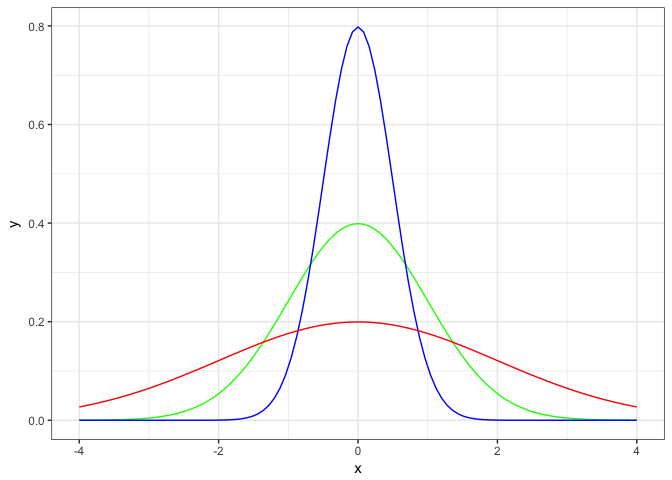

Gli indici di dispersione
-------------------------

Se $\\overline x$ è la **media aritmetica** del mio *campione*:

la **varianza *campionaria*** sarà:

$$
\\sigma^2 = {\\frac{\\sum(x-\\overline x)^2}{N-1}}
$$

e la **deviazione standard *campionaria*** o scarto quadratico medio *campionario*

$$
\\sigma = \\sqrt{\\frac{\\sum(x-\\overline x)^2}{N-1}}
$$

I nostri dati:
--------------

``` r
iris$Petal.Length
```

    ##   [1] 1.4 1.4 1.3 1.5 1.4 1.7 1.4 1.5 1.4 1.5 1.5 1.6 1.4 1.1 1.2 1.5 1.3
    ##  [18] 1.4 1.7 1.5 1.7 1.5 1.0 1.7 1.9 1.6 1.6 1.5 1.4 1.6 1.6 1.5 1.5 1.4
    ##  [35] 1.5 1.2 1.3 1.4 1.3 1.5 1.3 1.3 1.3 1.6 1.9 1.4 1.6 1.4 1.5 1.4 4.7
    ##  [52] 4.5 4.9 4.0 4.6 4.5 4.7 3.3 4.6 3.9 3.5 4.2 4.0 4.7 3.6 4.4 4.5 4.1
    ##  [69] 4.5 3.9 4.8 4.0 4.9 4.7 4.3 4.4 4.8 5.0 4.5 3.5 3.8 3.7 3.9 5.1 4.5
    ##  [86] 4.5 4.7 4.4 4.1 4.0 4.4 4.6 4.0 3.3 4.2 4.2 4.2 4.3 3.0 4.1 6.0 5.1
    ## [103] 5.9 5.6 5.8 6.6 4.5 6.3 5.8 6.1 5.1 5.3 5.5 5.0 5.1 5.3 5.5 6.7 6.9
    ## [120] 5.0 5.7 4.9 6.7 4.9 5.7 6.0 4.8 4.9 5.6 5.8 6.1 6.4 5.6 5.1 5.6 6.1
    ## [137] 5.6 5.5 4.8 5.4 5.6 5.1 5.1 5.9 5.7 5.2 5.0 5.2 5.4 5.1

Le medie
--------

``` r
ggplot() +
    geom_density(data = iris, aes(x = Petal.Length, fill = Species), 
                 binwidth = 0.1, color = "black", alpha = 2/3) +
    theme_bw()
```

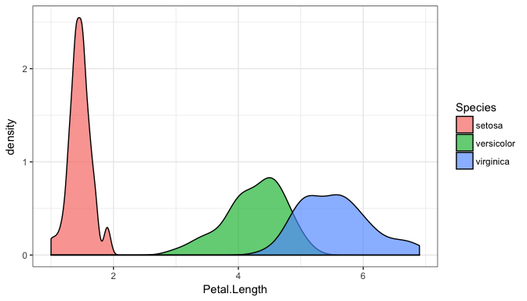

Calcolare la media per gruppi:
------------------------------

La funzione per il calcolo della media è `mean()`

``` r
mean(iris$Sepal.Length)
```

    ## [1] 5.843333

Se il nostro `dataframe` ha una colonna factor, possiamo raggupparlo con:

``` r
iris %>%
    group_by(Species) %>%
    summarise(mean_values = mean(Petal.Length))
```

    ## # A tibble: 3 x 2
    ##   Species    mean_values
    ##   <fct>            <dbl>
    ## 1 setosa            1.46
    ## 2 versicolor        4.26
    ## 3 virginica         5.55

Calcolare la deviazione standard
--------------------------------

In inglese è **standard deviation**, per cui la funzione è `sd()`

``` r
sd(iris$Petal.Length)
```

    ## [1] 1.765298

Come tutte le funzioni può essere applicata a gruppi:

``` r
iris %>%
    group_by(Species) %>%
    summarise(mean_values = mean(Petal.Length), standard_deviations = sd(Petal.Length))
```

    ## # A tibble: 3 x 3
    ##   Species    mean_values standard_deviations
    ##   <fct>            <dbl>               <dbl>
    ## 1 setosa            1.46               0.174
    ## 2 versicolor        4.26               0.470
    ## 3 virginica         5.55               0.552

------------------------------------------------------------------------

Lo salviamo in un dataframe

``` r
iris %>%
    group_by(Species) %>%
    summarise(mean_values = mean(Petal.Length), 
              standard_deviations = sd(Petal.Length)) -> iris_stat
```

------------------------------------------------------------------------

``` r
ggplot() +
    geom_density(data = iris, aes(x = Petal.Length, fill = Species), 
                 binwidth = 0.1, color = "black", alpha = 2/3) +
    geom_vline(data = iris_stat, 
               aes(xintercept = mean_values, color = Species), size = 1.5) +
    geom_vline(data = iris_stat, 
               aes(xintercept = mean_values + standard_deviations, color = Species), size = 0.7) +
    geom_vline(data = iris_stat, 
               aes(xintercept = mean_values - standard_deviations, color = Species), size = 0.7) +
    theme_bw()
```

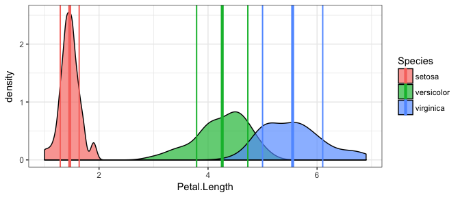

Una parentesi sull'operatore `%>%` (piping)
-------------------------------------------

-   Analogo del `+` di `ggplot2`
-   Esegue le funzioni in un ordine più leggibile
-   Formalmente passa il risultato come primo argomento della funzione

``` r
a %>% fun1() %>% fun2(arg2, arg3)
```

corrisponde a:

``` r
fun2(fun1(a), arg2, arg3)
```

La meccanica interna
--------------------

``` r
a %>% fun1() %>% fun2(arg2, arg3)
```

si appoggia ad una variabile transitoria

``` r
k <- fun1(a)
k <- fun2(k, arg2, arg3)
k
```

spesso (e soprattutto in questo caso) per le variabili transitorie si usa il punto

``` r
. <- fun1(a)
. <- fun2(. , arg2, arg3)
.
```

per un approfondimento (e un possibile argomento per un tutorial)

``` r
help("%>%")
```

La correlazione
===============

Un'occhiata ai dati
-------------------

``` r
library(GGally)
ggpairs(iris, binwidth = 0.1) + theme_bw()
```

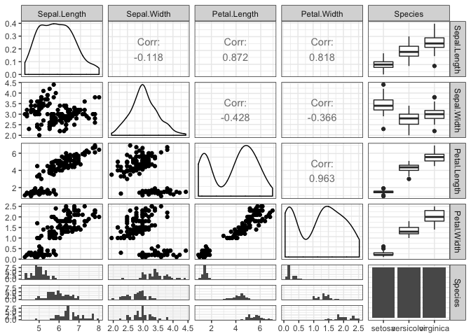

Un'occhiata ai dati
-------------------

``` r
ggpairs(iris, columns = c("Petal.Length", "Petal.Width", "Species"),
        mapping = aes(alpha = 0.20)) + theme_bw()
```

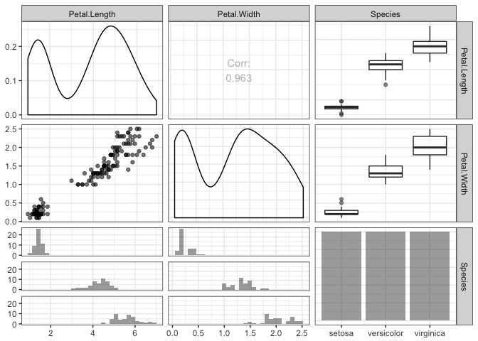

Un po' di colore
----------------

``` r
ggpairs(iris,
        mapping = aes(alpha = 0.20, color = Species)) + theme_bw()
```

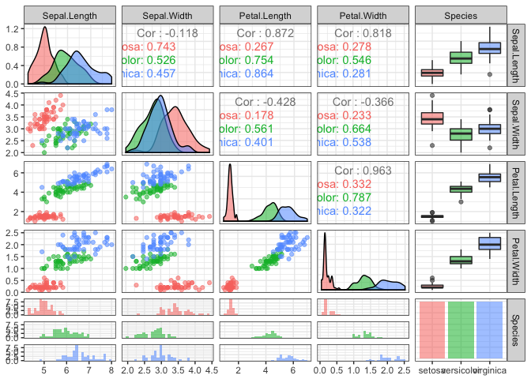

In dettaglio
------------

``` r
ggpairs(iris, columns = c("Petal.Length", "Petal.Width", "Species"),
        mapping = aes(alpha = 0.20, color = Species)) + theme_bw()
```

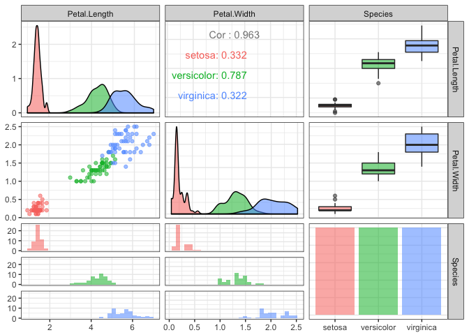

Correlazione
------------

``` r
library(corrplot)
cor_data <- cor(dplyr::select_if(iris, is.numeric))
corrplot.mixed(cor_data)
```

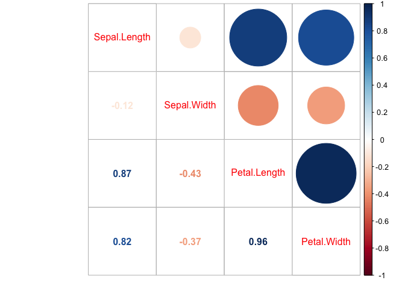

``` r
corrplot.mixed(cor_data, lower = "number", upper = "square", lower.col = "black")
```

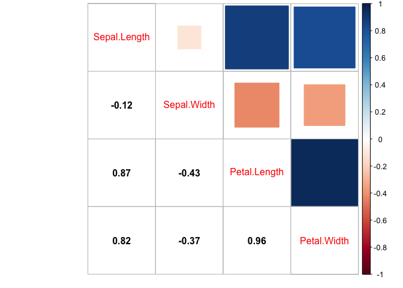

Un coefficiente di correlazione 0 non indica variabili indipendenti
===================================================================

------------------------------------------------------------------------

Esempi di valori di correlazione

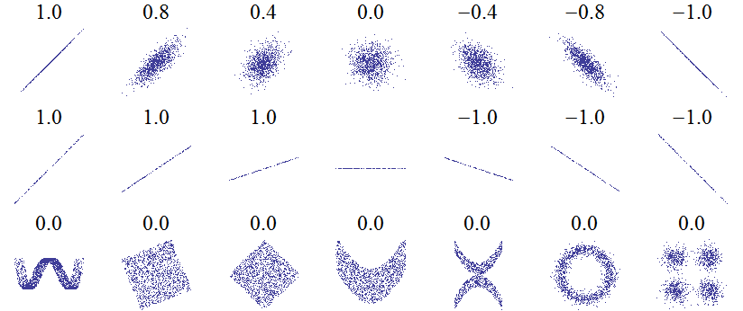

Il DATASAURO
------------


Regressioni lineari
===================

La regressione lineare
----------------------

Iniziamo da una variabile sola

creiamo una variabile da una distribuzione normale di media 5, la funzione che estrae i valori da una distribuzione **uniforme** era `runif()`, quella per la distribuzione **normale** è `rnorm()`.

Non scordiamoci il `set.seed()`

``` r
set.seed(42)
data <- data_frame(x = 1:10, y = rnorm(10, mean = 5))
```

------------------------------------------------------------------------

``` r
data
```

    ## # A tibble: 10 x 2
    ##        x     y
    ##    <int> <dbl>
    ##  1     1  6.37
    ##  2     2  4.44
    ##  3     3  5.36
    ##  4     4  5.63
    ##  5     5  5.40
    ##  6     6  4.89
    ##  7     7  6.51
    ##  8     8  4.91
    ##  9     9  7.02
    ## 10    10  4.94

------------------------------------------------------------------------

``` r
ggplot() +
    geom_point(data = data, aes(x = x, y = y), color = "purple", size = 3) +
    theme_bw()
```

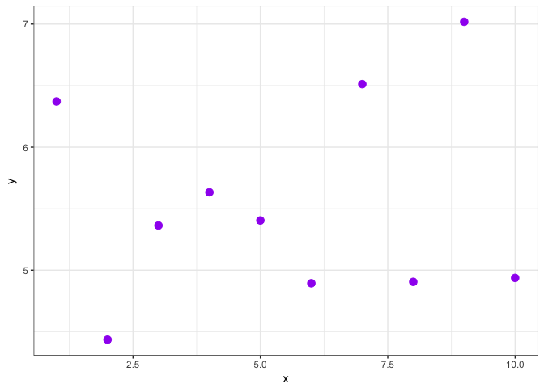

------------------------------------------------------------------------

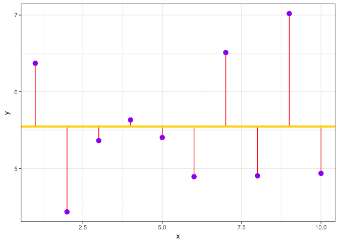

Il modello lineare minimo
-------------------------

``` r
mean(data$y)
```

    ## [1] 5.547297

``` r
lm(y ~ 1, data = data)
```

    ## 
    ## Call:
    ## lm(formula = y ~ 1, data = data)
    ## 
    ## Coefficients:
    ## (Intercept)  
    ##       5.547

------------------------------------------------------------------------

``` r
ggplot(lm(y ~ 1, data = data)) +
    geom_point(aes(x = data$x, y = .resid), size = 3, color = "purple") +
    theme_bw()
```

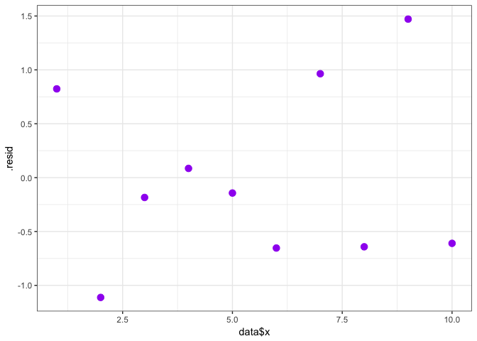

Anscombe's quartet
------------------

È un famoso esempio (l'origine del datasauro) di come i valori di una correlazione non indichino tutto, e di come una correlazione lineare possa non essere lo strumento adatto per analizzare i nostri dati:

``` r
summary(anscombe)
```

    ##        x1             x2             x3             x4    
    ##  Min.   : 4.0   Min.   : 4.0   Min.   : 4.0   Min.   : 8  
    ##  1st Qu.: 6.5   1st Qu.: 6.5   1st Qu.: 6.5   1st Qu.: 8  
    ##  Median : 9.0   Median : 9.0   Median : 9.0   Median : 8  
    ##  Mean   : 9.0   Mean   : 9.0   Mean   : 9.0   Mean   : 9  
    ##  3rd Qu.:11.5   3rd Qu.:11.5   3rd Qu.:11.5   3rd Qu.: 8  
    ##  Max.   :14.0   Max.   :14.0   Max.   :14.0   Max.   :19  
    ##        y1               y2              y3              y4        
    ##  Min.   : 4.260   Min.   :3.100   Min.   : 5.39   Min.   : 5.250  
    ##  1st Qu.: 6.315   1st Qu.:6.695   1st Qu.: 6.25   1st Qu.: 6.170  
    ##  Median : 7.580   Median :8.140   Median : 7.11   Median : 7.040  
    ##  Mean   : 7.501   Mean   :7.501   Mean   : 7.50   Mean   : 7.501  
    ##  3rd Qu.: 8.570   3rd Qu.:8.950   3rd Qu.: 7.98   3rd Qu.: 8.190  
    ##  Max.   :10.840   Max.   :9.260   Max.   :12.74   Max.   :12.500

------------------------------------------------------------------------

``` r
corrplot.mixed(cor(anscombe))
```

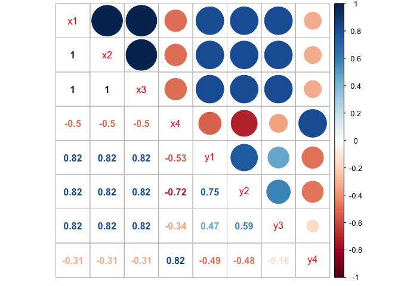

------------------------------------------------------------------------

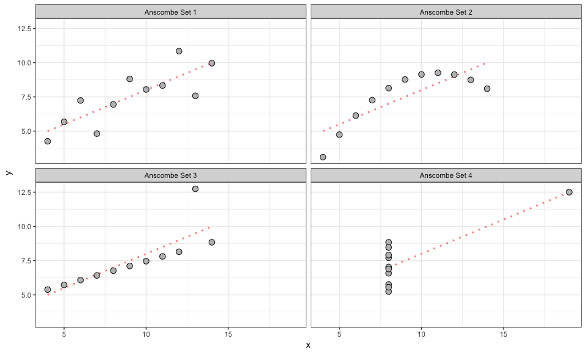
