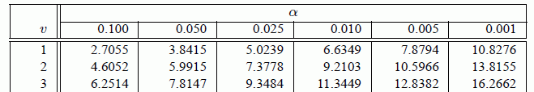

```{r setup, include=FALSE}
knitr::opts_chunk$set(cache = TRUE)
```

```{r, include=FALSE}
library(tidyverse)
library(knitr)
library(kableExtra)
```

```{r, include=FALSE}
kab <- function(...) {
    kable_styling(kable(...))
}
```


# la teoria

## Tabelle di contingenza 2x2 | che faccia hanno


```{r, echo=FALSE}
engine <- mtcars$vs
engine[engine == 0] <- "v_shaped"
engine[engine == 1] <- "straight"

trans <- mtcars$am
trans[trans == 0] <- "automatic"
trans[trans == 1] <- "manual"

a <- table(engine, trans)

kab(a)

```

I numeri nella tabella rappresentano il numero dei campioni che presentano contemporaneamente le aratteristiche indicate dalla loro riga e dalla loro colonna:

Ad esempio 12 modelli hanno un motore a V e il cambio automatico

## A cosa servono:

1. Riassumere i dati
2. Decidere se i due criteri di classificazione sono indipendenti

Nelle tavole 2x2 le variabili (o criteri di classificazione) sono di tipo binario:

* Vero/Falso
* Presente/Assente
* Vivo/Morto
* ecc/ecc

---

Per ragioni storiche si tende a mettere la variabile indipendente sulle righe:

* **vaccinato / non_vaccinato** sulle righe
* **sano / malato** sulle colonne


# I test di indipendenza delle variabili

___

La domanda a cui i dati possono rispondere è:

* Le due variabili sono indipendenti?
* Le due popolazioni di una variabile hanno caratteri differenti rispetto all'altra?

L'ipotesi nulla $H_0$ è interpretabile come:

* le due variabili siano indipendenti
* che il campioni siano estratti dalla stessa popolazione
* che la distribuzione rispetto a un criterio di classificazione non venga influenzata dalla classificazione secondo l'altro criterio

## Test del $\chi^2$   (chi-quadro) | _desueto e spesso sbagliato_

**Perché esiste?**

Perché prima dell'avvento dei calcolatori era l'unico calcolabile a mano in tempi ragionevoli.
Ha dei grossi problemi quando N è piccolo (<40) e quando alcune caselle hanno numeri piccoli (<5).
Rappresenta comunque un'approssimazione del valore esatto (che oggi è possibile calcolare senza sforzo).

_**N.B. non c'è alcun motivo per continuare a usarlo!**_

**Perché è importante conoscerlo:**

* per comprendere più facilmente l'idea dietro alla matematica
* perché quando ci si riferisce a questo tipo di test in genere si continuano a chiamare $\chi^2$

---

L'idea è di costruire una tabella dei valori attesi e vedere quanto la tabella che abbiamo misurato si discosta da quella dei valori attesi.

la tabella che misuriamo ha questi valori:

|$\mathbf{a}$|$\mathbf{b}$|
|---         |---         |
|$\mathbf{c}$|$\mathbf{d}$|

il primo passo è calcolare i totali marginali:

|$\mathbf{a}$|$\mathbf{b}$|$n_1 = a+b$  |
|---         |---         |---          |
|$\mathbf{c}$|$\mathbf{d}$|$n_2 = c+d$  |
|$n_3 = a+c$ |$n4 = b+d$  |$N = a+b+c+d$|

___

<div style="float: left; width: 50%;">

Dalla tabella dei totali marginali...

|              |              |$\mathbf{n_1}$|
|---           |---           |---           |
|              |              |$\mathbf{n_2}$|
|$\mathbf{n_3}$|$\mathbf{n_4}$|$\mathbf{N}$  |

</div>
<div style="float: right; width: 50%;">

...si calcolano le frequenze attese:

|$a_{att}=\frac{n_1*n_3}{N}$ |$b_{att}=\frac{n_1*n_4}{N}$ |$\mathbf{n_1}$|
|---           |---           |---           |
|$c_{att}=\frac{n_2*n_3}{N}$ |$d_{att}=\frac{n_2*n_4}{N}$ |$\mathbf{n_2}$|
|$\mathbf{n_3}$|$\mathbf{n_4}$|$\mathbf{N}$  |

</div>

### _!!! Gradi di libertà !!!_  
  
Vale la pena notare che i totali marginali sono considerati il vero dato certo del problema.
in questo caso il grado di libertà della tabella (cioè di $a$, $b$, $c$, e $d$) è in realtà uno solo:
se variassimo $a$, varieremmo di conseguenza anche tutti gli altri valori.

In generale i gradi di libertà di una tabella di contingenza sono:
$$GDL = (righe-1) * (colonne-1)$$

---

Adesso abbiamo:

<div style="float: left; width: 50%;">

la tabella delle frequenze attese...

|$\mathbf{A_1}$|$\mathbf{A_2}$|
|---         |---         |
|$\mathbf{A_3}$|$\mathbf{A_4}$|

</div>
<div style="float: right; width: 50%;">

...e la tabella delle frequenze osservete:

|$\mathbf{O_1}$|$\mathbf{O_1}$|
|---         |---         |
|$\mathbf{O_3}$|$\mathbf{O_4}$|

</div>

a questo punto si calcola il famigerato $\chi^2$:

$$\chi^2= \sum_{i=1}^{4}\frac{(O_i-A_i)^2}{A_i}$$

---

Questo valore viene confrontato con il valore indicato sulle tabelle del $\chi^2$:

```{r, echo=FALSE}

```

consultando la tabella possiamo vedere quale $\alpha$ superiamo sapendo che abbiamo un unico grado di libertà ($GDL = v = 1$)

Se il $\chi^2$ calcolato è più grande ti quello indicato dalla tabella posso rifiutare la mia $H_0$.


## Test esatto di Fisher | desueto e corretto solo in determinati casi

**Perché esiste?**

Perché storicamente è il primo test a fornire risultati esatti (anzi che approssimazioni). Fino all'avvento dei calcolatori era molto complesso da calcolare a mano, e anche con i calcolatori per tabelle di contingenza grandi o con N elevati può richiedere metodi di calcolo non banali.

La sua efficacia è tuttora valida solo nel caso si rispettino le caratteristiche sperimentali che hanno portato alla sua creazione: in poche parole _le somme marginali della tavola di contingenza devono essere tutte uguali e chiaramente stabilite prima dell'esperimento_.

---

_**N.B. non c'è alcun motivo per continuare a usarlo!**_

**Perché è importante conoscerlo:**

* rappresenta un passo storico nel calcolo della probabilità
* perché è ancora (a torto) molto utilizzato

---

Data la tabella di contingenza

|$\mathbf{a}$|$\mathbf{b}$|$n_1 = a+b$  |
|---         |---         |---          |
|$\mathbf{c}$|$\mathbf{d}$|$n_2 = c+d$  |
|$n_3 = a+c$ |$n4 = b+d$  |$N = a+b+c+d$|

Fisher dimostrò che la probabilità che una tale configurazione di $a$, $b$, $c$, e $d$ aveva una probabilità di realizzarsi calcolabile:

$$p = \frac{(a+b)!(c+d)!(a+c)!(b+d)!}{a! b! c! d! N}$$

A quel punto si poteva calcolare la probabilità di tutte le tabelle con configurazioni ancora più estreme, entrare nella tabella del $\chi^2$ e ottenere l'agognato **p-value**.

## Dov'è il problema del test di Fisher?

Il proplema è che il test è pensato per un tipo di esperimento particolare, in cui i totali marginali sono noti a priori (nell'esperimento di Fisher sono anche uguali, ma la formula non lo richiede), cosa comporta nella pratica questo:

* chi realizza il controllo conosce la proporzione della variabile indipendente
* **anche _la variabile indipendente_ conosce quella proporzione, e ci si attiene

In pratica questo non succede quasi mai.

L'esperimento per cui il test è stato disegnato è un _caposaldo del metodo scientifico_ e dovrebbe essere noto a tutti: [Lady tasting tea](https://en.wikipedia.org/wiki/Lady_tasting_tea)

## Per approfondire:

[Conditional versus Unconditional Exact Tests for Comparing Two Binomials, 2003](http://citeseerx.ist.psu.edu/viewdoc/download?doi=10.1.1.572.632&rep=rep1&type=pdf)

# la pratica

---

```{r}
table(mtcars$vs, mtcars$am)
kable(table(mtcars$vs, mtcars$am))
```

---

```{r, results='asis'}
table(mtcars$vs, mtcars$am) %>%
    kable() %>%
    kable_styling()
```

---

```{r}
v_shaped <- mtcars$vs
v_shaped[v_shaped == 0] <- "v_shaped"
v_shaped[v_shaped == 1] <- "straight"

transmission <- mtcars$am
transmission[transmission == 0] <- "automatic"
transmission[transmission == 1] <- "manual"

table(v_shaped, transmission)
```
