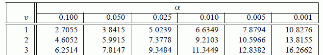

Lez\_2x2: Tavole (o tabelle) di contingenza
================

-   [La teoria](#la-teoria)
    -   [Tabelle di contingenza 2x2 | che faccia hanno](#tabelle-di-contingenza-2x2-che-faccia-hanno)
    -   [A cosa servono:](#a-cosa-servono)
    -   [Le risposte](#le-risposte)
    -   [*Excursus sui campioni appaiati:*](#excursus-sui-campioni-appaiati)
-   [I test di indipendenza delle variabili](#i-test-di-indipendenza-delle-variabili)
    -   [Condizionamento delle tabelle](#condizionamento-delle-tabelle)
    -   [Test del *χ*<sup>2</sup> (chi-quadro) di Pearson | *Pearson's chi-squared test*](#test-del-chi2-chi-quadro-di-pearson-pearsons-chi-squared-test)
        -   [*!!! Gradi di libertà !!!*](#gradi-di-libertà)
    -   [Test esatto di Fisher | *Fisher's Exact test*](#test-esatto-di-fisher-fishers-exact-test)
    -   [Dov'è il problema del test di Fisher?](#dovè-il-problema-del-test-di-fisher)
    -   [Test del *χ*<sup>2</sup> con 'N-1' | *'N-1' chi-squared test*](#test-del-chi2-con-n-1-n-1-chi-squared-test)
    -   [Altre cose che succedono nei test di indipendenza delle variabili:](#altre-cose-che-succedono-nei-test-di-indipendenza-delle-variabili)
        -   [*χ*<sup>2</sup> con la correzione per la continuità di Yates](#chi2-con-la-correzione-per-la-continuità-di-yates)
    -   [Quale test usare?](#quale-test-usare)
-   [Test per la differenza di proporzioni:](#test-per-la-differenza-di-proporzioni)
    -   [Quale scegliere:](#quale-scegliere)
    -   [*z*-test per la differenza fra due proporzioni | *Two proportions *z*-test*](#z-test-per-la-differenza-fra-due-proporzioni-two-proportions-z-test)
    -   [Metodi di simulazione:](#metodi-di-simulazione)
    -   [Altre cose che succedono nei test di differenza fra proporzioni:](#altre-cose-che-succedono-nei-test-di-differenza-fra-proporzioni)
-   [Test di McNemar](#test-di-mcnemar)
    -   [Per approfondire:](#per-approfondire)
-   [la pratica](#la-pratica)
    -   [I dati di partenza](#i-dati-di-partenza)
    -   [La tabella di contingenza](#la-tabella-di-contingenza)
    -   [Presupposti delle misure](#presupposti-delle-misure)
    -   [Le nostre 3 domande](#le-nostre-3-domande)
    -   [P-hacking | cose che tutti fanno ma nessuno lo dice!](#p-hacking-cose-che-tutti-fanno-ma-nessuno-lo-dice)
    -   [1. Test di indipendenza delle variabili](#test-di-indipendenza-delle-variabili)
    -   [2. Test per la differenza di proporzioni](#test-per-la-differenza-di-proporzioni-1)

La teoria
=========

Tabelle di contingenza 2x2 | che faccia hanno
---------------------------------------------

Nelle tabelle di contingenza vengono riassunti i dati di due variabili binomiali (cioè di tipo qualitativo che possono assumere solo due valori).

-   Vero/Falso,
-   Presente/Assente
-   Cane/Gatto
-   ecc/ecc

Si ricorda che le categorie devono essere **esclusive** ed **esaustive**:

-   **Esclusive**: nessun dato può ricadere simultaneamente in tutte e due
-   **Esaustive**: tutti i dati possono essere assegnati a una o all'altra categoria

------------------------------------------------------------------------

I campioni devono in teoria essere **indipendenti**, non devono cioè essere legati uno all'altro in modo particolare, come ad esempio 20 persone di 8 famiglie.

Come abbiamo osservato più volte questa difficoltà viene spesso ignorata.

------------------------------------------------------------------------

Se le due variabili possono essere considerate causa/effetto per questioni storiche si preferisce mettere le cause come nomi delle righe, gli effetti come nomi delle colonne.

Per i fini statistici è indifferente quale variabile è sulle righe e quale sulle colonne.

------------------------------------------------------------------------

Partendo da una tabella contenente dati di questo tipo:

<table class="table" style="margin-left: auto; margin-right: auto;">
<thead>
<tr>
<th style="text-align:right;">
ID
</th>
<th style="text-align:left;">
Specie
</th>
<th style="text-align:left;">
Danno
</th>
</tr>
</thead>
<tbody>
<tr>
<td style="text-align:right;">
1
</td>
<td style="text-align:left;">
Quercia
</td>
<td style="text-align:left;">
Danno
</td>
</tr>
<tr>
<td style="text-align:right;">
2
</td>
<td style="text-align:left;">
Pino
</td>
<td style="text-align:left;">
Danno
</td>
</tr>
<tr>
<td style="text-align:right;">
3
</td>
<td style="text-align:left;">
Pino
</td>
<td style="text-align:left;">
Danno
</td>
</tr>
<tr>
<td style="text-align:right;">
4
</td>
<td style="text-align:left;">
Quercia
</td>
<td style="text-align:left;">
Sano
</td>
</tr>
<tr>
<td style="text-align:right;">
5
</td>
<td style="text-align:left;">
Quercia
</td>
<td style="text-align:left;">
Sano
</td>
</tr>
<tr>
<td style="text-align:right;">
6
</td>
<td style="text-align:left;">
Quercia
</td>
<td style="text-align:left;">
Sano
</td>
</tr>
<tr>
<td style="text-align:right;">
7
</td>
<td style="text-align:left;">
Pino
</td>
<td style="text-align:left;">
Sano
</td>
</tr>
<tr>
<td style="text-align:right;">
8
</td>
<td style="text-align:left;">
Pino
</td>
<td style="text-align:left;">
Sano
</td>
</tr>
<tr>
<td style="text-align:right;">
9
</td>
<td style="text-align:left;">
Pino
</td>
<td style="text-align:left;">
Sano
</td>
</tr>
<tr>
<td style="text-align:right;">
10
</td>
<td style="text-align:left;">
Pino
</td>
<td style="text-align:left;">
Sano
</td>
</tr>
</tbody>
</table>

------------------------------------------------------------------------

si passa a una tabella di contingenza:

<table class="table" style="margin-left: auto; margin-right: auto;">
<thead>
<tr>
<th style="text-align:left;">
</th>
<th style="text-align:right;">
Pino
</th>
<th style="text-align:right;">
Quercia
</th>
</tr>
</thead>
<tbody>
<tr>
<td style="text-align:left;">
Danno
</td>
<td style="text-align:right;">
2
</td>
<td style="text-align:right;">
1
</td>
</tr>
<tr>
<td style="text-align:left;">
Sano
</td>
<td style="text-align:right;">
4
</td>
<td style="text-align:right;">
3
</td>
</tr>
</tbody>
</table>
***Non è rilevante quale variabile finisce sulle righe e quale sulle colonne***

I numeri nella tabella rappresentano il numero dei campioni che presentano contemporaneamente le aratteristiche indicate dalla loro riga e dalla loro colonna:

Ad esempio abbiamo:

-   2 pini danneggiati
-   una quercia danneggiata
-   4 pini sani
-   3 querce sane

A cosa servono:
---------------

A rispondere a 3 specifiche domande:

1.  I due criteri di classificazione (le due variabili) sono indipendenti?
2.  Uno dei due valori di una variabile è più comune in uno dei valori della seconda variabile? (c'è una differenza con il punto 2)
3.  La proporzione di una variabile è uguale a quella dell'altra?

Nel nostro caso cerchiamo di tradurre le domande:

1.  La specie di una pianta e la sua probabilità di essere danneggiata sono indipendenti?
2.  I danni sono più comuni fra i pini o fra le quercie?
3.  La proporzione di piante danneggiate è uguale alla proporzione delle quercie?

*vale la pena di notare che la domanda numero 3 ha poco senso, il caso è opposto però con altri tipi di dati, in particolare quelli di misure ripetute:*

------------------------------------------------------------------------

Nel caso di dati derivanti da misure pre-post trattamento:

La tabella:

<table class="table" style="margin-left: auto; margin-right: auto;">
<thead>
<tr>
<th style="text-align:right;">
ID
</th>
<th style="text-align:left;">
Seme
</th>
<th style="text-align:left;">
Semenzale
</th>
</tr>
</thead>
<tbody>
<tr>
<td style="text-align:right;">
1
</td>
<td style="text-align:left;">
Seme Infetto
</td>
<td style="text-align:left;">
Semenzale Infetto
</td>
</tr>
<tr>
<td style="text-align:right;">
2
</td>
<td style="text-align:left;">
Seme Sano
</td>
<td style="text-align:left;">
Semenzale Infetto
</td>
</tr>
<tr>
<td style="text-align:right;">
3
</td>
<td style="text-align:left;">
Seme Sano
</td>
<td style="text-align:left;">
Semenzale Infetto
</td>
</tr>
<tr>
<td style="text-align:right;">
4
</td>
<td style="text-align:left;">
Seme Infetto
</td>
<td style="text-align:left;">
Semenzale Sano
</td>
</tr>
<tr>
<td style="text-align:right;">
5
</td>
<td style="text-align:left;">
Seme Infetto
</td>
<td style="text-align:left;">
Semenzale Sano
</td>
</tr>
<tr>
<td style="text-align:right;">
6
</td>
<td style="text-align:left;">
Seme Infetto
</td>
<td style="text-align:left;">
Semenzale Sano
</td>
</tr>
<tr>
<td style="text-align:right;">
7
</td>
<td style="text-align:left;">
Seme Sano
</td>
<td style="text-align:left;">
Semenzale Sano
</td>
</tr>
<tr>
<td style="text-align:right;">
8
</td>
<td style="text-align:left;">
Seme Sano
</td>
<td style="text-align:left;">
Semenzale Sano
</td>
</tr>
<tr>
<td style="text-align:right;">
9
</td>
<td style="text-align:left;">
Seme Sano
</td>
<td style="text-align:left;">
Semenzale Sano
</td>
</tr>
<tr>
<td style="text-align:right;">
10
</td>
<td style="text-align:left;">
Seme Sano
</td>
<td style="text-align:left;">
Semenzale Sano
</td>
</tr>
</tbody>
</table>

La tavola di contingenza:

<table class="table" style="margin-left: auto; margin-right: auto;">
<thead>
<tr>
<th style="text-align:left;">
</th>
<th style="text-align:right;">
Semenzale Infetto
</th>
<th style="text-align:right;">
Semenzale Sano
</th>
</tr>
</thead>
<tbody>
<tr>
<td style="text-align:left;">
Seme Infetto
</td>
<td style="text-align:right;">
1
</td>
<td style="text-align:right;">
3
</td>
</tr>
<tr>
<td style="text-align:left;">
Seme Sano
</td>
<td style="text-align:right;">
2
</td>
<td style="text-align:right;">
4
</td>
</tr>
</tbody>
</table>

------------------------------------------------------------------------

Le nostre tre domande diventano:

1.  La probabilità di una pianta di essere danneggiata prima e dopo sono indipendenti?
    *In linea di principio non dovrebbero essere per nulla indipendenti, la suscettibilità di una pianta è dovuta a un sacco di fattori diversi*
2.  Il danno dopo il trattamento è più comune fra le piante che erano sane prima?
    *La domanda è complessa e apre scenari interessanti.*
3.  La proporzione di danni tra "prima"" e "dopo" il trattamento è diversa?
    *Cioè il trattamento è servito a qualcosa???*

*in questo contesto la domanda numero 3 è generalmente quella più interessante*

Le risposte
-----------

Le risposte a queste tre domande vengono da tre test statistici differenti:

1.  Test di indipendenza delle variabili
2.  *z*-test per la differenza fra due proporzioni
3.  Test di McNemar

*Excursus sui campioni appaiati:*
---------------------------------

Il problema dei campioni appaiati (*paired*) viene eluso quasi completamente da questo approccio. In moti testi è scritto che il test di McNamar sia da utilizzare in caso di campioni appaiati.
Come abbiamo visto spesso nel caso di misure ripetute McNamar non è il test *giusto*, ma il test *che risponde alla domanda principale*.

C'è però un altro modo di accoppiare i campioni: quando gli elementi hanno una relazione a coppie rispetto ad una variabile che non vogliamo influenzi i nostri calcoli (ad es. diametro del primo elemento con valore 0 = diametro del primo elemento con valore 1)

In questo caso occorre *controllare per il fattore di appaiamento* nell'analisi, e un test non appaiato può risultare più efficace. Poiché qui la faccenda si complica ed esula dallo scopo di questa lezione. Si consiglia di consultare [*Pearce, 2015*](https://www.bmj.com/content/352/bmj.i969).

I test di indipendenza delle variabili
======================================

Condizionamento delle tabelle
-----------------------------

Il punto chiave per capire quale test sia opportuno o meno usare è il concetto di *condizionamento* delle tabelle:

Nonostante le tabelle 2x2 si presentino sotto questa forma:

| **a** | **b** |
|-------|-------|
| **c** | **d** |

una parte fondamentale è ricoperta dai **totali marginali**:

|                             |                  | *n*<sub>1</sub> = *a* + *b* |
|-----------------------------|------------------|-----------------------------|
|                             |                  | *n*<sub>2</sub> = *c* + *d* |
| *n*<sub>3</sub> = *a* + *c* | *n*4 = *b* + *d* | *N* = *a* + *b* + *c* + *d* |

------------------------------------------------------------------------

La domanda è: **quanti di questi totali eravamo in grado di prevedere prima che l'esperimento iniziasse?**

-   *N* non è noto a priori (campioniamo finchè non siamo stanchi, finiamo i soldi, tramonta il sole...).
    *Normalmente questo non succede, ma se succede...*

Questo metodo è noto come campionamento di *Poisson*, la distribuzione delle variabili segue una distribuzione di *Poisson*, invece di una più comune distribuzione *binomiale*.

Nelle tavole di contingenza questo cambia poco perché le variabili di *Poisson* vengono normalmente trattate come *binomiali*. È importante però non perdere di vista questo dettaglio per altre analisi.

------------------------------------------------------------------------

-   *N* è stato deciso in ufficio, ma:

-   Se non conosciamo **né** righe **né** colonne allora la tabella è ***non condizionata***
-   Se conosciamo solo **o** righe **o** colonne (se per esempio abbiamo impostato noi una delle variabili, magari con 50% dei casi *A*, e 50% *B*) come nella **stragrande maggioranza dei disegni sperimentali**, allora la tabella è di tipo intermedio (***singly conditioned***)
-   Se conosciamo tutti i totali marginali, allora la tabella è ***condizionata***. Questo è il caso solo se anche *chi* fornisce la variabile dipendente conosce in anticipo la distribuzione della variabile indipendente. Questo caso non si verifica quasi mai.

------------------------------------------------------------------------

Cosa succede adesso?

Normalmente per ogni tipologia di tabella la letteratura consiglia un diffferente test statistico, e tecnicamente questo è corretto. In generale però possiamo semplificarci abbastanza la vita e dare delle indicazioni di massima.

Segue un breve elenco dei test statistici che dovete conoscere, e quindi delle indicazioni su quando usare l'uno o l'altro.

------------------------------------------------------------------------

Test del *χ*<sup>2</sup> (chi-quadro) di Pearson | *Pearson's chi-squared test*
-------------------------------------------------------------------------------

**Karl Pearson**, non Egon Pearson

Anche noto come:

-   test del *χ*<sup>2</sup> (chi-quadro)
-   *goodness-of-fit test*
-   *Pearson's goodness-of-fit*

------------------------------------------------------------------------

***Desueto e spesso sbagliato***

**Perché esiste?**

Perché prima dell'avvento dei calcolatori era l'unico calcolabile a mano in tempi ragionevoli. Ha dei grossi problemi quando N è piccolo (&lt;40) e quando alcune caselle hanno numeri piccoli (&lt;5). Rappresenta comunque un'approssimazione del valore esatto (che oggi è possibile calcolare senza sforzo).

***N.B. non c'è alcun motivo per continuare a usarlo!***

**Perché è importante conoscerlo:**

-   per comprendere più facilmente l'idea dietro alla matematica
-   perché è tuttora la base di questo tipo di analisi

------------------------------------------------------------------------

L'idea è di costruire una tabella dei valori attesi e vedere quanto la tabella che abbiamo misurato si discosta da quella dei valori attesi.

la tabella che misuriamo ha questi valori:

| **a** | **b** |
|-------|-------|
| **c** | **d** |

il primo passo è calcolare i totali marginali:

| **a**                       | **b**            | *n*<sub>1</sub> = *a* + *b* |
|-----------------------------|------------------|-----------------------------|
| **c**                       | **d**            | *n*<sub>2</sub> = *c* + *d* |
| *n*<sub>3</sub> = *a* + *c* | *n*4 = *b* + *d* | *N* = *a* + *b* + *c* + *d* |

------------------------------------------------------------------------

Dalla tabella dei totali marginali...

|                       |                       | **n**<sub>**1**</sub> |
|-----------------------|-----------------------|-----------------------|
|                       |                       | **n**<sub>**2**</sub> |
| **n**<sub>**3**</sub> | **n**<sub>**4**</sub> | **N**                 |

...si calcolano le frequenze attese:

| $a\_{att}=\\frac{n\_1\*n\_3}{N}$ | $b\_{att}=\\frac{n\_1\*n\_4}{N}$ | **n**<sub>**1**</sub> |
|----------------------------------|----------------------------------|-----------------------|
| $c\_{att}=\\frac{n\_2\*n\_3}{N}$ | $d\_{att}=\\frac{n\_2\*n\_4}{N}$ | **n**<sub>**2**</sub> |
| **n**<sub>**3**</sub>            | **n**<sub>**4**</sub>            | **N**                 |

### *!!! Gradi di libertà !!!*

Vale la pena notare che i totali marginali sono considerati il vero dato certo del problema. in questo caso il grado di libertà della tabella (cioè di *a*, *b*, *c*, e *d*) è in realtà uno solo: se variassimo *a*, varieremmo di conseguenza anche tutti gli altri valori.

In generale i gradi di libertà di una tabella di contingenza sono:
*G**D**L* = (*r**i**g**h**e* − 1)\*(*c**o**l**o**n**n**e* − 1)

------------------------------------------------------------------------

Adesso abbiamo:

la tabella delle frequenze attese...

| **A**<sub>**1**</sub> | **A**<sub>**2**</sub> |
|-----------------------|-----------------------|
| **A**<sub>**3**</sub> | **A**<sub>**4**</sub> |

...e la tabella delle frequenze osservete:

| **O**<sub>**1**</sub> | **O**<sub>**1**</sub> |
|-----------------------|-----------------------|
| **O**<sub>**3**</sub> | **O**<sub>**4**</sub> |

a questo punto si calcola il famigerato *χ*<sup>2</sup>:

$$\\chi^2= \\sum\_{i=1}^{4}\\frac{(O\_i-A\_i)^2}{A\_i}$$

------------------------------------------------------------------------

Questo valore viene confrontato con il valore indicato sulle tabelle del *χ*<sup>2</sup>:



consultando la tabella possiamo vedere quale *α* superiamo sapendo che abbiamo un unico grado di libertà (*G**D**L* = *v* = 1)

Se il *χ*<sup>2</sup> calcolato è più grande ti quello indicato dalla tabella posso rifiutare la mia *H*<sub>0</sub>.

Test esatto di Fisher | *Fisher's Exact test*
---------------------------------------------

**corretto solo in determinati casi**

Noto anche come:

-   Fisher-Irwin's test
-   Fisher-Yates' test

------------------------------------------------------------------------

**Perché è così usato?**

Perché storicamente è il primo test a fornire risultati esatti (anzi che approssimazioni). Fino all'avvento dei calcolatori era molto complesso da calcolare a mano, e anche con i calcolatori per tabelle di contingenza grandi o con N elevati può richiedere metodi di calcolo non banali.

La sua efficacia è valida solo nel caso si rispettino le caratteristiche sperimentali che hanno portato alla sua creazione: in poche parole *le somme marginali della tavola di contingenza devono essere chiaramente stabilite prima dell'esperimento*, la tabella deve essere in pratica **condizionata**.

------------------------------------------------------------------------

***N.B. non c'è alcun motivo per continuare a usarlo!***

**Perché è importante conoscerlo:**

-   rappresenta un passo storico nel calcolo della probabilità
-   è il test corretto per le tabelle condizionate
-   perché è ancora (spesso a torto) molto utilizzato

------------------------------------------------------------------------

Data la tabella di contingenza

| **a**                       | **b**            | *n*<sub>1</sub> = *a* + *b* |
|-----------------------------|------------------|-----------------------------|
| **c**                       | **d**            | *n*<sub>2</sub> = *c* + *d* |
| *n*<sub>3</sub> = *a* + *c* | *n*4 = *b* + *d* | *N* = *a* + *b* + *c* + *d* |

Fisher dimostrò che la probabilità che una tale configurazione di *a*, *b*, *c*, e *d* aveva una probabilità di realizzarsi calcolabile:

$$p = \\frac{(a+b)!(c+d)!(a+c)!(b+d)!}{a! b! c! d! N}$$

A quel punto si poteva calcolare la probabilità di tutte le tabelle con configurazioni ancora più estreme, entrare nella tabella del *χ*<sup>2</sup> e ottenere l'agognato **p-value**.

Dov'è il problema del test di Fisher?
-------------------------------------

Il proplema è che il test è pensato per un tipo di esperimento particolare, in cui i totali marginali sono noti a priori (nell'esperimento di Fisher sono anche uguali, ma la formula non lo richiede), cosa comporta nella pratica questo:

-   chi realizza il controllo conosce la proporzione della variabile indipendente
-   anche la variabile indipendente *conosce* quella proporzione

In pratica questo non succede quasi mai.

L'esperimento per cui il test è stato disegnato è un *caposaldo del metodo scientifico* e dovrebbe essere noto a tutti: [Lady tasting tea](https://en.wikipedia.org/wiki/Lady_tasting_tea)

Test del *χ*<sup>2</sup> con 'N-1' | *'N-1' chi-squared test*
-------------------------------------------------------------

o **Test del *χ*<sup>2</sup> di Egon Pearson** (non Karl Pearson)

Equivalente al **Test del *χ*<sup>2</sup> di Mantel‐Haenszel** (Mantel‐Haenszel chi‐squared test) per tabelle 2x2 **senza correzioni per la continuità**.

Possiamo considerarlo come una variante del test classico del *χ*<sup>2</sup>, quello di Karl pearson, in cui però
$$\\chi^2\_{N-1} = \\chi^2 \* \\frac{N-1}{N}$$

Questo test è al momento uno dei più robusti da utilizzare nell'analisi delle tavole 2x2 nel caso in cui non siano condizionate o siano semi-condizionate.

Altre cose che succedono nei test di indipendenza delle variabili:
------------------------------------------------------------------

### *χ*<sup>2</sup> con la correzione per la continuità di Yates

Yates voleva correggere il *χ*<sup>2</sup> per ottenere valori simili al test esatto di Fisher, perché quello era troppo difficile da calcolare. Ora esistono i computer.

Quale test usare?
-----------------

Il dibattito attorno a quale test utilizzare sembra non terminare mai, ma qui si seguiranno le indicazioni di [Campbell 2007](https://onlinelibrary.wiley.com/doi/abs/10.1002/sim.2832):

*NB: le indicazioni non rappresentano lo stato dell'arte, che si può seguire sull'interessante [nota all'articolo di Andrés](https://onlinelibrary.wiley.com/doi/abs/10.1002/sim.3169) ma sono nondimeno un solido punto di partenza.*

Tabelle non condizionate o semi-condizionate:

-   Se la tabella contiene uno 0, si usa il **test esatto di Fisher-Irwin secondo la regola di Irwin** (Fisher-Irwin test by Irwin's rule)
-   Altrimenti si usa il **test del *χ*<sup>2</sup> con 'N-1'** ('N-1' chi-squared test)

Tabelle condizionate:

-   **Test esatto di Fisher.**

Test per la differenza di proporzioni:
======================================

Quale scegliere:
----------------

Storicamente si è sempre utilizzato lo ***z*-test per la differenza fra due proporzioni**.
Normalmente però si tratta di campioni enormi, che spesso nei nostri casi mancano.
In generale:

-   Se tutte le celle sono &gt;30 si può tranquillamente ustilizzare lo ***z*-test**
-   Se tutte le celle sono &gt;10 la *letteratura* raccomanda comunque lo ***z*-test**
-   Se anche una sola cella ha meno di 10 campioni si passa ai **metodi di simulazione**

*z*-test per la differenza fra due proporzioni | *Two proportions *z*-test*
---------------------------------------------------------------------------

**ASSUNTI**: nessuna casella è minore di 10!

Ricordiamo che lo *z*-test è la versione del *t*-test che usa direttamente la distribuzione normale invece della *t* di Student.

In questo caso non si usa il *t*-test, che sembrerebbe il più corretto, avendo per le mani degli stimatori e non i valori noti, perché i numeri sono abbastanza grandi da evitarci il *t*-test.
Queti motivi non mi sono chiarissimi, *chi avesse voglia di lanciarsi in un po' di simulazioni per vedere le differenze è il benvenuto.*

Metodi di simulazione:
----------------------

Tornando alla tabella

<table class="table" style="margin-left: auto; margin-right: auto;">
<thead>
<tr>
<th style="text-align:left;">
</th>
<th style="text-align:right;">
Pino
</th>
<th style="text-align:right;">
Quercia
</th>
</tr>
</thead>
<tbody>
<tr>
<td style="text-align:left;">
Danno
</td>
<td style="text-align:right;">
2
</td>
<td style="text-align:right;">
1
</td>
</tr>
<tr>
<td style="text-align:left;">
Sano
</td>
<td style="text-align:right;">
4
</td>
<td style="text-align:right;">
3
</td>
</tr>
</tbody>
</table>
vogliamo controllare se i pini sono davvero più malati delle quercie.

-   L'ipotesi *H*<sub>0</sub> è che le proporzioni di piante malate derivino da un'unica popolazione che non differenzia rispetto alla specie:
    *H*<sub>0</sub> : *p*<sub>*p**i**n**i*</sub> − *p*<sub>*q**u**e**r**c**i**e*</sub> = 0
-   Calcoliamo la differenza di proporzioni dei dati è
    $$\\hat{p}\_{pini} - \\hat{p}\_{quercie} = \\frac{2}{6} - \\frac{1}{4} \\approx 0.0832$$

------------------------------------------------------------------------

Il procedimento è piuttosto lineare:

1.  Si prendono 3 carte nere e 7 carte rosse (le nere per le piante malate, le rosse per le piante sane)
2.  Dividiamo le carte in un gruppo da sei (i pini) e uno da 4 (le quercie)
3.  Calcoliamo di nuovo $\\hat{p}\_{pini} - \\hat{p}\_{quercie}$ e lo segnamo
4.  Ripetiamo i passi 2 e 3 un **botto di volte**, tipo 1000.
5.  Vediamo in che percentuale di casi il valore supera 0.0832 (che avevamo ottenuto dalla tabella)
6.  Dividiamo la percentuale per 100 e otteniamo il nostro p-value

In pratica si calcola un p-value di forza bruta. La cosa è fattibile quasi solo con l'ausilio del calcolatore.

Altre cose che succedono nei test di differenza fra proporzioni:
----------------------------------------------------------------

Storicamente un approccio comune era il seguente:

-   Campioni numerosi (&gt;30 per ogni cella): Pearson's chi-square
-   Campioni intermedi (&gt;10 per ogni cella): Yates' chi-square
-   Campioni piccoli (anche una cella &lt;10): Fisher's exact test

*Upton (1982)* e *D'Agostino (1988)* eliminano dal gioco sia Yates che Fisher

Test di McNemar
===============

Per approfondire:
-----------------

[Una pagina di partenza per le Tavole di Contingenza](http://www.jerrydallal.com/LHSP/ctab.htm)

[Quando usare il test di McNemar](https://stats.stackexchange.com/a/141450/232657)

[Conditional versus Unconditional Exact Tests for Comparing Two Binomials, 2003](http://citeseerx.ist.psu.edu/viewdoc/download?doi=10.1.1.572.632&rep=rep1&type=pdf)

la pratica
==========

I dati di partenza
------------------

Carichiamo i dati da un foglio Excel:

``` r
library(readxl)
read_excel(path = "data.xlsx")
```

    ## # A tibble: 28 x 31
    ##    X__1  `Pseudotsuga me… `Brachypodium p… `Castanea sativ…
    ##    <chr>            <dbl>            <dbl> <chr>           
    ##  1 Plot…             62.5              0   0               
    ##  2 Plot…             15                0   0               
    ##  3 Plot…             37.5              0   O               
    ##  4 Plot…              0.1             37.5 .               
    ##  5 Plot…              0                3   .               
    ##  6 Plot…              0                3   <NA>            
    ##  7 Plot…              0                3   <NA>            
    ##  8 Plot…              0.5              0   <NA>            
    ##  9 Plot…              0.1              0   0               
    ## 10 Plot…              0.5              0   0               
    ## # ... with 18 more rows, and 27 more variables: `Cirsium vulgare` <dbl>,
    ## #   `Clematis vitalba` <dbl>, `Clinopodium vulgare` <dbl>, `Crataegus
    ## #   laevigata` <dbl>, `Eupatorium cannabinum` <dbl>, `Fagus
    ## #   sylvatica` <dbl>, `Fragaria vesca` <dbl>, `Galium odoratum` <dbl>,
    ## #   `Hedera helix` <dbl>, `Hieracium racemosum` <dbl>, `Hypericum
    ## #   perforatum` <dbl>, `Lapsana communis` <dbl>, `Pinus sylvestris` <dbl>,
    ## #   `Poa pratensis` <dbl>, `Pteridium aquilinum` <dbl>, `Pulmonaria
    ## #   hirta` <dbl>, `Pyrus pyraster` <dbl>, `Quercus cerris` <dbl>,
    ## #   `Ranunculus repens` <dbl>, `Rosa canina` <dbl>, `Rubus
    ## #   ulmifolius` <dbl>, `Salvia glutinosa` <dbl>, `Solidago
    ## #   virgaurea` <dbl>, `Spartium junceum` <dbl>, `Urtica dioica` <dbl>,
    ## #   `Vicia sativa` <dbl>, `Viola odorata` <dbl>

Le specie sono state mescolate per mantenere la riservatezza del dataset.
L'unica variabile corretta è `Pseudotsuga menziesii`, che è la specie di riferimento delle misurazioni.

------------------------------------------------------------------------

I numeri son abbondanze relative (percentuali di copertura) di diverse specie.
La tabella ha (come dovrebbe) le specie sulle colonne, le misure di copertura sulle righe.

Controlliamo la tabella:

``` r
DB <- read_excel(path = "data.xlsx")[, -1] # eliminiamo la colonna con i nomi
str(DB)
```

    ## Classes 'tbl_df', 'tbl' and 'data.frame':    28 obs. of  30 variables:
    ##  $ Pseudotsuga menziesii: num  62.5 15 37.5 0.1 0 0 0 0.5 0.1 0.5 ...
    ##  $ Brachypodium pinnatum: num  0 0 0 37.5 3 3 3 0 0 0 ...
    ##  $ Castanea sativa      : chr  "0" "0" "O" "." ...
    ##  $ Cirsium vulgare      : num  0 0 0 0 0 0 0 0 0 0 ...
    ##  $ Clematis vitalba     : num  0.5 3.01 0.1 0 0 0.5 0.1 0 3 0 ...
    ##  $ Clinopodium vulgare  : num  0 0 0 0 0 0 0 0 0 0 ...
    ##  $ Crataegus laevigata  : num  0.5 37.5 37.5 65.5 102.5 ...
    ##  $ Eupatorium cannabinum: num  37.5 37.5 0.1 0.1 3 0.1 0.1 0 0.1 0.5 ...
    ##  $ Fagus sylvatica      : num  15 0.1 0 0.1 0.1 0.1 0.1 0.1 0.1 0.1 ...
    ##  $ Fragaria vesca       : num  0.5 0.1 0.2 3 3 0 0 0.1 0.1 0.1 ...
    ##  $ Galium odoratum      : num  0 0 0 0 0 0 0 0 3 0 ...
    ##  $ Hedera helix         : num  0.5 0.1 3 15 0.1 3 0 0.1 0 0.5 ...
    ##  $ Hieracium racemosum  : num  0 0 0 0.5 0.1 0.1 0 0 0 0 ...
    ##  $ Hypericum perforatum : num  0 0 0 0 0 0 0 0 0 0 ...
    ##  $ Lapsana communis     : num  0 0.1 0 0 0 0 0 0 0 0.1 ...
    ##  $ Pinus sylvestris     : num  0 0 0.1 0.1 0 0 0 0 0 0 ...
    ##  $ Poa pratensis        : num  3 0 3 0 0.5 0 0 0 3 0 ...
    ##  $ Pteridium aquilinum  : num  0 0 0 0 0 0 0 0 0 0 ...
    ##  $ Pulmonaria hirta     : num  0 0 0 0 0 0 0 0.1 0 0 ...
    ##  $ Pyrus pyraster       : num  0 0 0 0 0 0 0 0 0 0 ...
    ##  $ Quercus cerris       : num  0 0 3.01 0 0 0 0 0 0 0 ...
    ##  $ Ranunculus repens    : num  0 0 0 0 0 0 0 0 0 0 ...
    ##  $ Rosa canina          : num  0 3 3 15 0 0 0 0 0 3 ...
    ##  $ Rubus ulmifolius     : num  0 0 0 0.1 0 0.1 0 0 0 0 ...
    ##  $ Salvia glutinosa     : num  0 0 0 0 0 0 0.1 0.5 0 0 ...
    ##  $ Solidago virgaurea   : num  0 0.1 0 0.1 0 0.1 0.1 0.1 0 0 ...
    ##  $ Spartium junceum     : num  0 0 0 0 0.1 0 0.1 0 0 0 ...
    ##  $ Urtica dioica        : num  0.5 0 0 0 0 0.1 0 0 0 0 ...
    ##  $ Vicia sativa         : num  3 3 3 0 0 0 0 0 0 0 ...
    ##  $ Viola odorata        : num  37.5 0 37.5 0 0 0 0 0 0 0 ...

------------------------------------------------------------------------

La colonna del castagno è stata identificata come `chr` perché alcune caselle hanno dei `.` invece che `0`. Si correggono subito e si trasforma di nuovo la variabile in `num`:

``` r
DB$`Castanea sativa`[DB$`Castanea sativa` == "."] <- 0 # spazi nei nomi delle 
# colonne ci cotringono a usare gli apici ` [alt + \]

# Non la metto subito al suo posto nel DB perché facilmente con as.numeric si 
# perdono dei dati che potrei voler ricostruire
Castanea_sativa <- as.numeric(DB$`Castanea sativa`) 
```

    ## Warning: si è prodotto un NA per coercizione

Il programma avvisa che uno dei valori non era numerico, e quindi è stato perso.

------------------------------------------------------------------------

Confrontiamo i `NA` della colonna del `DB` con quelli della variabile `Castanea_sativa`

``` r
DB$`Castanea sativa`[is.na(Castanea_sativa) & !is.na(DB$`Castanea sativa`)]
```

    ## [1] "O"

Questa `O` al posto dello `0` è un problema classico, si corregge facilmente:

``` r
Castanea_sativa[DB$`Castanea sativa` == "O"] <- 0
DB$`Castanea sativa` <- Castanea_sativa
```

``` r
sum(is.na(DB)) # in queste tabelle se ci sono zeri non ci dovrebbero essere NA
```

    ## [1] 3

------------------------------------------------------------------------

Ce sono 3 `NA` che non si spiegano, in questo caso:

1.  Si ricontrollano i cartacei da cui sono stati trascritti i dati
2.  Si chiedono delucidazioni al rilevatore
3.  Si sceglie se imputare i dati mancanti o recuperarli in qualche altro modo

Nel nostro caso erano degli errori di battitura di celle che avrebbero dovuto essere `0`.

``` r
DB$`Castanea sativa`[is.na(DB$`Castanea sativa`)] <- 0
```

``` r
min(DB) # mi aspetto che il minimo sia 0, e conti come assenza
```

    ## [1] 0

``` r
max(DB) # che sia sopra il 100% non è un problema, se è spiegato nei M&M
```

    ## [1] 125

------------------------------------------------------------------------

È importante che le variabili siano di tipo **binomiale**, in questo caso dati di presenza/assenza.

La prassi è sostituire tutte le coperture `>0` con un `1`.

``` r
DB[DB > 0] <- 1
```

La tabella di contingenza
-------------------------

Consideriamo le variabili `Pseudotsuga menziesii` e `Clematis vitalba`:

``` r
PSEMEN <- DB$`Pseudotsuga menziesii`
CLEVIT <- DB$`Clematis vitalba`
```

la tabella di contingenza si crea con un solo comando:

``` r
tavola_PSEMEN_CLEVIT <- table(PSEMEN, CLEVIT)
tavola_PSEMEN_CLEVIT
```

    ##       CLEVIT
    ## PSEMEN  0  1
    ##      0  3  6
    ##      1 12  7

Presupposti delle misure
------------------------

**Il campionamento è di tipo multinomiale**: il numero dei plot da misurare è stato deciso prima di iniziare le misure.

**La tabella non è condizionata**: una volta arrivati sui plot si sono scelti punti con un principio completamente indipendente dalla presenza o meno di *Douglasia* o di *vitalba*, i totali marginali non erano assolutamente prevedibili.

Le nostre 3 domande
-------------------

Ritorniamo alle nostre 3 specifiche domande:

1.  I due criteri di classificazione (le due variabili) sono indipendenti?
2.  Uno dei due valori di una variabile è più comune in uno dei valori della seconda variabile? (c'è una differenza con il punto 2)
3.  La proporzione di una variabile è uguale a quella dell'altra?

Nel nostro caso cerchiamo di tradurre le domande:

1.  La presenza della *Douglasia* è indipendente da quella della *vitalba*
2.  La *Douglasia* si rinnova meno dove c'è la *vitalba*?
3.  La proporzione di plot con la *Douglasia* è uguale alla proporzione di plot con la *vitalba*?

*vale la pena di notare che la domanda numero 3 in questo caso può essere interessante, come no*

P-hacking | cose che tutti fanno ma nessuno lo dice!
----------------------------------------------------

È importante riconoscere che le domande dovrebbero essere state decise **prima di andare in campo**, solo in questo caso i p-value hanno un vero significato.

-   siamo ancora nel campo dell'*hypotesis testing*

Sel la domanda viene scelta dopo aver visto i dati (ma a un buon forestale spesso basta vedere il bosco) i p-value diventano solo indicativi, e siamo tenuti a scriverlo a chiare lettere:

-   siamo nel campo delle *analisi esplorative*

1. Test di indipendenza delle variabili
---------------------------------------

Nessuna delle caselle è `0`, quindi si procede con il **'N-1' Pearson's Chi-Squared Test** Si ricorda che nel caso **2x2** il test è equivalente al **Mantel-Haenszel Chi-Squared senza la correzione per la continuità**

Prima si crea un vettore necessario per il test composto da un numero N di cifre uguali:

``` r
stratum <- rep(1, length(PSEMEN)) # la lunghezza di una qualsiasi variabile è = N
```

La funzione `mantelhaen.test()` nel nostro caso ha bisogno di 4 argomenti:

1.  La prima variabile
2.  La seconda variabile
3.  Un vettore che identifichi gli strati (nel nostro caso tutto uguale)
4.  `correct = FALSE`, per evitare di applicare la *correzione per la continuità*

------------------------------------------------------------------------

``` r
mantelhaen.test(PSEMEN, CLEVIT, stratum, correct = FALSE)
```

    ## 
    ##  Mantel-Haenszel chi-squared test without continuity correction
    ## 
    ## data:  PSEMEN and CLEVIT and stratum
    ## Mantel-Haenszel X-squared = 2.1061, df = 1, p-value = 0.1467
    ## alternative hypothesis: true common odds ratio is not equal to 1
    ## 95 percent confidence interval:
    ##  0.05489338 1.54972130
    ## sample estimates:
    ## common odds ratio 
    ##         0.2916667

Nel nostro caso il p-value è ben maggiore di 0.05. Le variabili risultano indipendenti.

2. Test per la differenza di proporzioni
----------------------------------------

In questo caso ci chiediamo se ci sia più *vitalba* dove la *Douglasia* non si rinnova:

-   L'ipotesi *H*<sub>0</sub> è che le proporzioni di *vitalba* derivino da un'unico tipo di plot, che non risente della rinnovazione o meno della douglasia, in questo caso *p* è la proporzione di plot con rinnovazione di *vitalba*:
    *H*<sub>0</sub> : *p*<sub>*N**O**d**o**u**g**l**a**s**i**a*</sub> − *p*<sub>*d**o**u**g**l**a**s**i**a*</sub> = 0
-   Calcoliamo la differenza di proporzioni dei dati è
    $$\\hat{p}\_{NOdouglasia} - \\hat{p}\_{douglasia} = \\frac{6}{9} - \\frac{7}{19}$$

------------------------------------------------------------------------

``` r
diff_p <- (tavola_PSEMEN_CLEVIT[1, 2]/sum(tavola_PSEMEN_CLEVIT[1, ])) - (tavola_PSEMEN_CLEVIT[2, 2]/sum(tavola_PSEMEN_CLEVIT[2, ]))
diff_p
```

    ## [1] 0.2982456

La funzione vuole le variabili inserite come colonne di un `data.frame`, e nel caso di variabili qualitative (come le nostre) che siano colonne di tipo `factor` invece che `numeric`

``` r
data <- data.frame(CLEVIT = as.factor(CLEVIT), PSEMEN = as.factor(PSEMEN))
```

------------------------------------------------------------------------

``` r
library(statsr)
inference(CLEVIT, PSEMEN, data = data, type = "ht", statistic = "proportion", 
          success = "1", method = "simulation", order = c("0", "1"), null = 0, 
          alternative = "greater", nsim = 10000, 
          show_eda_plot = FALSE, show_inf_plot = FALSE)
```

    ## Response variable: categorical (2 levels, success: 1)
    ## Explanatory variable: categorical (2 levels) 
    ## n_0 = 9, p_hat_0 = 0.6667
    ## n_1 = 19, p_hat_1 = 0.3684
    ## H0: p_0 =  p_1
    ## HA: p_0 > p_1
    ## p_value = 0.1498

------------------------------------------------------------------------

``` r
inference(CLEVIT, PSEMEN, data = data, type = "ht", statistic = "proportion", 
          success = "1", method = "simulation", order = c("0", "1"), null = 0, 
          alternative = "greater", nsim = 10000, 
          show_var_types = FALSE, show_summ_stats = FALSE, show_res = FALSE)
```


