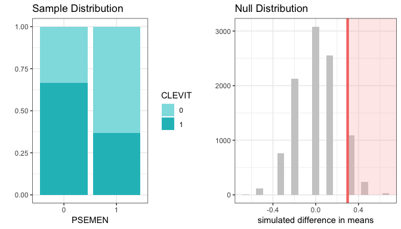

Lez\_2x2: Tavole (o tabelle) di contingenza. La pratica
================

-   [I dati di partenza](#i-dati-di-partenza)
-   [La tabella di contingenza](#la-tabella-di-contingenza)
-   [Presupposti delle misure](#presupposti-delle-misure)
-   [Le nostre 3 domande](#le-nostre-3-domande)
-   [P-hacking | cose che tutti fanno ma nessuno lo dice!](#p-hacking-cose-che-tutti-fanno-ma-nessuno-lo-dice)
-   [1. Test di indipendenza delle variabili](#test-di-indipendenza-delle-variabili)
-   [2. Test per la differenza di proporzioni](#test-per-la-differenza-di-proporzioni)
-   [3. Test di McNemar](#test-di-mcnemar)
-   [Confrontare variabili multiple](#confrontare-variabili-multiple)
    -   [Le tabelle di contingenza](#le-tabelle-di-contingenza)
    -   [P-hacking | cose che tutti fanno ma nessuno lo dice!](#p-hacking-cose-che-tutti-fanno-ma-nessuno-lo-dice-1)
    -   [1. Test di indipendenza delle variabili](#test-di-indipendenza-delle-variabili-1)
    -   [2. Test per la differenza di proporzioni](#test-per-la-differenza-di-proporzioni-1)

I dati di partenza
------------------

Carichiamo i dati da un foglio Excel:

``` r
library(readxl)
read_excel(path = "files/data.xlsx")
```

    ## # A tibble: 28 x 31
    ##    X__1  `Pseudotsuga me… `Brachypodium p… `Castanea sativ…
    ##    <chr>            <dbl>            <dbl> <chr>           
    ##  1 Plot…             62.5              0   0               
    ##  2 Plot…             15                0   0               
    ##  3 Plot…             37.5              0   O               
    ##  4 Plot…              0.1             37.5 .               
    ##  5 Plot…              0                3   .               
    ##  6 Plot…              0                3   <NA>            
    ##  7 Plot…              0                3   <NA>            
    ##  8 Plot…              0.5              0   <NA>            
    ##  9 Plot…              0.1              0   0               
    ## 10 Plot…              0.5              0   0               
    ## # ... with 18 more rows, and 27 more variables: `Cirsium vulgare` <dbl>,
    ## #   `Clematis vitalba` <dbl>, `Clinopodium vulgare` <dbl>, `Crataegus
    ## #   laevigata` <dbl>, `Eupatorium cannabinum` <dbl>, `Fagus
    ## #   sylvatica` <dbl>, `Fragaria vesca` <dbl>, `Galium odoratum` <dbl>,
    ## #   `Hedera helix` <dbl>, `Hieracium racemosum` <dbl>, `Hypericum
    ## #   perforatum` <dbl>, `Lapsana communis` <dbl>, `Pinus sylvestris` <dbl>,
    ## #   `Poa pratensis` <dbl>, `Pteridium aquilinum` <dbl>, `Pulmonaria
    ## #   hirta` <dbl>, `Pyrus pyraster` <dbl>, `Quercus cerris` <dbl>,
    ## #   `Ranunculus repens` <dbl>, `Rosa canina` <dbl>, `Rubus
    ## #   ulmifolius` <dbl>, `Salvia glutinosa` <dbl>, `Solidago
    ## #   virgaurea` <dbl>, `Spartium junceum` <dbl>, `Urtica dioica` <dbl>,
    ## #   `Vicia sativa` <dbl>, `Viola odorata` <dbl>

------------------------------------------------------------------------

Le specie sono state mescolate per mantenere la riservatezza del dataset.
L'unica variabile corretta è `Pseudotsuga menziesii`, che è la specie di riferimento delle misurazioni.

I numeri son abbondanze relative (percentuali di copertura) di diverse specie.
La tabella ha (come dovrebbe) le specie sulle colonne, le misure di copertura sulle righe.

------------------------------------------------------------------------

Controlliamo la tabella:

``` r
DB <- read_excel(path = "files/data.xlsx")[, -1] # eliminiamo la colonna con i nomi
str(DB)
```

    ## Classes 'tbl_df', 'tbl' and 'data.frame':    28 obs. of  30 variables:
    ##  $ Pseudotsuga menziesii: num  62.5 15 37.5 0.1 0 0 0 0.5 0.1 0.5 ...
    ##  $ Brachypodium pinnatum: num  0 0 0 37.5 3 3 3 0 0 0 ...
    ##  $ Castanea sativa      : chr  "0" "0" "O" "." ...
    ##  $ Cirsium vulgare      : num  0 0 0 0 0 0 0 0 0 0 ...
    ##  $ Clematis vitalba     : num  0.5 3.01 0.1 0 0 0.5 0.1 0 3 0 ...
    ##  $ Clinopodium vulgare  : num  0 0 0 0 0 0 0 0 0 0 ...
    ##  $ Crataegus laevigata  : num  0.5 37.5 37.5 65.5 102.5 ...
    ##  $ Eupatorium cannabinum: num  37.5 37.5 0.1 0.1 3 0.1 0.1 0 0.1 0.5 ...
    ##  $ Fagus sylvatica      : num  15 0.1 0 0.1 0.1 0.1 0.1 0.1 0.1 0.1 ...
    ##  $ Fragaria vesca       : num  0.5 0.1 0.2 3 3 0 0 0.1 0.1 0.1 ...
    ##  $ Galium odoratum      : num  0 0 0 0 0 0 0 0 3 0 ...
    ##  $ Hedera helix         : num  0.5 0.1 3 15 0.1 3 0 0.1 0 0.5 ...
    ##  $ Hieracium racemosum  : num  0 0 0 0.5 0.1 0.1 0 0 0 0 ...
    ##  $ Hypericum perforatum : num  0 0 0 0 0 0 0 0 0 0 ...
    ##  $ Lapsana communis     : num  0 0.1 0 0 0 0 0 0 0 0.1 ...
    ##  $ Pinus sylvestris     : num  0 0 0.1 0.1 0 0 0 0 0 0 ...
    ##  $ Poa pratensis        : num  3 0 3 0 0.5 0 0 0 3 0 ...
    ##  $ Pteridium aquilinum  : num  0 0 0 0 0 0 0 0 0 0 ...
    ##  $ Pulmonaria hirta     : num  0 0 0 0 0 0 0 0.1 0 0 ...
    ##  $ Pyrus pyraster       : num  0 0 0 0 0 0 0 0 0 0 ...
    ##  $ Quercus cerris       : num  0 0 3.01 0 0 0 0 0 0 0 ...
    ##  $ Ranunculus repens    : num  0 0 0 0 0 0 0 0 0 0 ...
    ##  $ Rosa canina          : num  0 3 3 15 0 0 0 0 0 3 ...
    ##  $ Rubus ulmifolius     : num  0 0 0 0.1 0 0.1 0 0 0 0 ...
    ##  $ Salvia glutinosa     : num  0 0 0 0 0 0 0.1 0.5 0 0 ...
    ##  $ Solidago virgaurea   : num  0 0.1 0 0.1 0 0.1 0.1 0.1 0 0 ...
    ##  $ Spartium junceum     : num  0 0 0 0 0.1 0 0.1 0 0 0 ...
    ##  $ Urtica dioica        : num  0.5 0 0 0 0 0.1 0 0 0 0 ...
    ##  $ Vicia sativa         : num  3 3 3 0 0 0 0 0 0 0 ...
    ##  $ Viola odorata        : num  37.5 0 37.5 0 0 0 0 0 0 0 ...

------------------------------------------------------------------------

La colonna del castagno è stata identificata come `chr` perché alcune caselle hanno dei `.` invece che `0`. Si correggono subito e si trasforma di nuovo la variabile in `num`:

``` r
DB$`Castanea sativa`[DB$`Castanea sativa` == "."] <- 0 # spazi nei nomi delle 
# colonne ci costringono a usare gli apici ` [alt + \]

# Non la metto subito al suo posto nel DB perché facilmente con as.numeric si 
# perdono dei dati che potrei voler ricostruire
Castanea_sativa <- as.numeric(DB$`Castanea sativa`) 
```

    ## Warning: si è prodotto un NA per coercizione

Il programma avvisa che uno dei valori non era numerico, e quindi è stato perso.

------------------------------------------------------------------------

Confrontiamo i `NA` della colonna del `DB` con quelli della variabile `Castanea_sativa`

``` r
DB$`Castanea sativa`[is.na(Castanea_sativa) & !is.na(DB$`Castanea sativa`)]
```

    ## [1] "O"

Questa `O` al posto dello `0` è un problema classico, si corregge facilmente:

``` r
Castanea_sativa[DB$`Castanea sativa` == "O"] <- 0
DB$`Castanea sativa` <- Castanea_sativa
```

``` r
sum(is.na(DB)) # in queste tabelle se ci sono zeri non ci dovrebbero essere NA
```

    ## [1] 3

------------------------------------------------------------------------

Ce sono 3 `NA` che non si spiegano, in questo caso:

1.  Si ricontrollano i cartacei da cui sono stati trascritti i dati
2.  Si chiedono delucidazioni al rilevatore
3.  Si sceglie se imputare i dati mancanti o recuperarli in qualche altro modo

Nel nostro caso erano degli errori di battitura di celle che avrebbero dovuto essere `0`.

``` r
DB$`Castanea sativa`[is.na(DB$`Castanea sativa`)] <- 0
```

``` r
min(DB) # mi aspetto che il minimo sia 0, e conti come assenza
```

    ## [1] 0

``` r
max(DB) # che sia sopra il 100% non è un problema, se è spiegato nei M&M
```

    ## [1] 125

------------------------------------------------------------------------

È importante che le variabili siano di tipo **binomiale**, in questo caso dati di presenza/assenza.

La prassi è sostituire tutte le coperture `>0` con un `1`.

``` r
DB[DB > 0] <- 1
```

La tabella di contingenza
-------------------------

Consideriamo le variabili `Pseudotsuga menziesii` e `Clematis vitalba`:

``` r
PSEMEN <- DB$`Pseudotsuga menziesii`
CLEVIT <- DB$`Clematis vitalba`
```

la tabella di contingenza si crea con un solo comando:

``` r
tavola_PSEMEN_CLEVIT <- table(PSEMEN, CLEVIT)
tavola_PSEMEN_CLEVIT
```

    ##       CLEVIT
    ## PSEMEN  0  1
    ##      0  3  6
    ##      1 12  7

Presupposti delle misure
------------------------

**Il campionamento è di tipo multinomiale**: il numero dei plot da misurare è stato deciso prima di iniziare le misure.

**La tabella non è condizionata**: una volta arrivati sui plot si sono scelti punti con un principio completamente indipendente dalla presenza o meno di *Douglasia* o di *vitalba*, i totali marginali non erano assolutamente prevedibili.

Le nostre 3 domande
-------------------

Ritorniamo alle nostre 3 specifiche domande:

1.  I due criteri di classificazione (le due variabili) sono indipendenti?
2.  Uno dei due valori di una variabile è più comune in uno dei valori della seconda variabile? (c'è una differenza con il punto 2)
3.  La proporzione di una variabile è uguale a quella dell'altra?

Nel nostro caso cerchiamo di tradurre le domande:

1.  La presenza della *Douglasia* è indipendente da quella della *vitalba*
2.  La *Douglasia* si rinnova meno dove c'è la *vitalba*?
3.  La proporzione di plot con la *Douglasia* è uguale alla proporzione di plot con la *vitalba*?

*vale la pena di notare che la domanda numero 3 in questo caso può essere interessante, come no*

P-hacking | cose che tutti fanno ma nessuno lo dice!
----------------------------------------------------

È importante riconoscere che le domande dovrebbero essere state decise **prima di andare in campo**, solo in questo caso i p-value hanno un vero significato.

-   siamo ancora nel campo dell'*hypothesis testing*

Sel la domanda viene scelta dopo aver visto i dati (ma a un buon forestale spesso basta vedere il bosco) i p-value diventano solo indicativi, e siamo tenuti a scriverlo a chiare lettere:

-   siamo nel campo delle *analisi esplorative*

1. Test di indipendenza delle variabili
---------------------------------------

Nessuna delle caselle è `0`, quindi si procede con il **'N-1' Pearson's Chi-Squared Test** Si ricorda che nel caso **2x2** il test è equivalente al **Mantel-Haenszel Chi-Squared senza la correzione per la continuità**

Prima si crea un vettore necessario per il test composto da un numero N di cifre uguali:

``` r
stratum <- rep(1, length(PSEMEN)) # la lunghezza di una qualsiasi variabile è = N
```

La funzione `mantelhaen.test()` nel nostro caso ha bisogno di 4 argomenti:

1.  La prima variabile
2.  La seconda variabile
3.  Un vettore che identifichi gli strati (nel nostro caso tutto uguale)
4.  `correct = FALSE`, per evitare di applicare la *correzione per la continuità*

------------------------------------------------------------------------

``` r
mantelhaen.test(PSEMEN, CLEVIT, stratum, correct = FALSE)
```

    ## 
    ##  Mantel-Haenszel chi-squared test without continuity correction
    ## 
    ## data:  PSEMEN and CLEVIT and stratum
    ## Mantel-Haenszel X-squared = 2.1061, df = 1, p-value = 0.1467
    ## alternative hypothesis: true common odds ratio is not equal to 1
    ## 95 percent confidence interval:
    ##  0.05489338 1.54972130
    ## sample estimates:
    ## common odds ratio 
    ##         0.2916667

Nel nostro caso il p-value è ben maggiore di 0.05. Le variabili risultano indipendenti.

2. Test per la differenza di proporzioni
----------------------------------------

In questo caso ci chiediamo se ci sia più *vitalba* dove la *Douglasia* non si rinnova:

-   L'ipotesi *H*<sub>0</sub> è che le proporzioni di *vitalba* derivino da un'unico tipo di plot, che non risente della rinnovazione o meno della douglasia, in questo caso *p* è la proporzione di plot con rinnovazione di *vitalba*:
    *H*<sub>0</sub> : *p*<sub>*N**O**d**o**u**g**l**a**s**i**a*</sub> − *p*<sub>*d**o**u**g**l**a**s**i**a*</sub> = 0
-   Calcoliamo la differenza di proporzioni dei dati è
    $$\\hat{p}\_{NOdouglasia} - \\hat{p}\_{douglasia} = \\frac{6}{9} - \\frac{7}{19}$$

------------------------------------------------------------------------

``` r
diff_p <- (tavola_PSEMEN_CLEVIT[1, 2]/sum(tavola_PSEMEN_CLEVIT[1, ])) - (tavola_PSEMEN_CLEVIT[2, 2]/sum(tavola_PSEMEN_CLEVIT[2, ]))
diff_p
```

    ## [1] 0.2982456

La funzione vuole le variabili inserite come colonne di un `data.frame`, e nel caso di variabili qualitative (come le nostre) che siano colonne di tipo `factor` invece che `numeric`

``` r
data <- data.frame(CLEVIT = as.factor(CLEVIT), PSEMEN = as.factor(PSEMEN))
```

------------------------------------------------------------------------

``` r
library(statsr)
set.seed(42) # la funzione inference usa dei metodi casuali, per assicurare la 
# riproducibilità dei risultati è necessario impostare il `seed`
inference(CLEVIT, PSEMEN, data = data, type = "ht", statistic = "proportion", 
          success = "1", method = "simulation", order = c("0", "1"), null = 0, 
          alternative = "greater", nsim = 10000, 
          show_eda_plot = FALSE, show_inf_plot = FALSE)
```

    ## Response variable: categorical (2 levels, success: 1)
    ## Explanatory variable: categorical (2 levels) 
    ## n_0 = 9, p_hat_0 = 0.6667
    ## n_1 = 19, p_hat_1 = 0.3684
    ## H0: p_0 =  p_1
    ## HA: p_0 > p_1
    ## p_value = 0.135

------------------------------------------------------------------------

``` r
set.seed(42)
inference(CLEVIT, PSEMEN, data = data, type = "ht", statistic = "proportion", 
          success = "1", method = "simulation", order = c("0", "1"), null = 0, 
          alternative = "greater", nsim = 10000, 
          show_var_types = FALSE, show_summ_stats = FALSE, show_res = FALSE)
```



3. Test di McNemar
------------------

Poichè *c* + *d* &gt; 6 possiamo utilizzare il **mid-*p* Test di McNemar**, in questo caso abbiamo scritto una funzione apposita: `mcnemar_midp()`

``` r
mcnemar_midp(tavola_PSEMEN_CLEVIT)$mid.p
```

    ## 
    ## mid-p McNemar test, two-sided version
    ##     mid-p-value = 0.167

    ## [1] 0.1670685

Confrontare variabili multiple
==============================

------------------------------------------------------------------------

Mettiamo ora il caso che (come in pratica spesso capita) io voglia confrontare una molteplicità di variabili fra loro:

mettiamo il caso più semplice (come è effettivamente il nostro), che io voglia confrontare tutte le specie erbacee rilevate con la rinnovazione di *douglasia*.

In questo caso ripartiamo dal `DB`:

``` r
head(DB)
```

    ## # A tibble: 6 x 30
    ##   `Pseudotsuga me… `Brachypodium p… `Castanea sativ… `Cirsium vulgar…
    ##              <dbl>            <dbl>            <dbl>            <dbl>
    ## 1                1                0                0                0
    ## 2                1                0                0                0
    ## 3                1                0                0                0
    ## 4                1                1                0                0
    ## 5                0                1                0                0
    ## 6                0                1                0                0
    ## # ... with 26 more variables: `Clematis vitalba` <dbl>, `Clinopodium
    ## #   vulgare` <dbl>, `Crataegus laevigata` <dbl>, `Eupatorium
    ## #   cannabinum` <dbl>, `Fagus sylvatica` <dbl>, `Fragaria vesca` <dbl>,
    ## #   `Galium odoratum` <dbl>, `Hedera helix` <dbl>, `Hieracium
    ## #   racemosum` <dbl>, `Hypericum perforatum` <dbl>, `Lapsana
    ## #   communis` <dbl>, `Pinus sylvestris` <dbl>, `Poa pratensis` <dbl>,
    ## #   `Pteridium aquilinum` <dbl>, `Pulmonaria hirta` <dbl>, `Pyrus
    ## #   pyraster` <dbl>, `Quercus cerris` <dbl>, `Ranunculus repens` <dbl>,
    ## #   `Rosa canina` <dbl>, `Rubus ulmifolius` <dbl>, `Salvia
    ## #   glutinosa` <dbl>, `Solidago virgaurea` <dbl>, `Spartium
    ## #   junceum` <dbl>, `Urtica dioica` <dbl>, `Vicia sativa` <dbl>, `Viola
    ## #   odorata` <dbl>

Le tabelle di contingenza
-------------------------

Mettiamo da parte la colonna `Pseudotsuga menziesii` teniamo tutte le altre variabili in un `data.frame`. Come ricordiamo un `data.frame` è essenzialmente una `list` di colonne:

``` r
PSEMEN <- DB$`Pseudotsuga menziesii`
herbs <- DB[, -1]
```

invece di una tavola di contingenza possiamo a questo punto creare una lista di tavole di contingenza:

``` r
tavole_di_contingenza <- lapply(herbs, table, PSEMEN)
tavole_di_contingenza[1]
```

    ## $`Brachypodium pinnatum`
    ##    PSEMEN
    ##      0  1
    ##   0  5 13
    ##   1  4  6

P-hacking | cose che tutti fanno ma nessuno lo dice!
----------------------------------------------------

A questo punto abbiamo allegramente abbandonato il mondo dell'*Hypothesis testing*, stiamo letteralmente andando a caccia di risultati.

Questo non ci vieta di controllare la validità dei p-value che otteniamo: sarà importante alla fine applicare dei metodi di correzione per le comparazioni multiple.

1. Test di indipendenza delle variabili
---------------------------------------

possiamo controllare automaticamente quali delle tavole hanno delle caselle `= 0`:

ricordandomi che `lapply()` lavora sul contenuto dell'*i*-esimo elemento, non sull'elemento stesso.
cfr. `list[i]` con `list[[i]]`

``` r
tavole_di_contingenza[[1]] == 0 # controllo cosa succede al primo elemento
```

    ##    PSEMEN
    ##         0     1
    ##   0 FALSE FALSE
    ##   1 FALSE FALSE

``` r
sum(tavole_di_contingenza[[1]] == 0) # si costruisce la funzione un passo alla volta
```

    ## [1] 0

------------------------------------------------------------------------

Adesso sono pronto ad applicarlo alla `list`

``` r
tavole_con_zeri <- lapply(tavole_di_contingenza, function(x) sum(x == 0))
```

Ho ottenuto una lista con `0` per le tavole senza zeri, e numeri maggiori di `0` per tavole con degli zeri.

``` r
herbs_con_zeri <- tavole_di_contingenza[tavole_con_zeri > 0]
herbs_senza_zeri <- tavole_di_contingenza[tavole_con_zeri == 0]
```

------------------------------------------------------------------------

Nei casi in cui delle caselle è `0`, si procede con il **'N-1' Pearson's Chi-Squared Test** Si ricorda che nel caso **2x2** il test è equivalente al **Mantel-Haenszel Chi-Squared senza la correzione per la continuità**

Prima recuperiamo le colonne giuste: il punto chiave è che i loro nomi sono gli stessi degli elementi della lista `herbs_senza_zeri`

``` r
DB_senza_zeri <- herbs[, names(herbs_senza_zeri)]
```

Prima si crea una lista di vettor necessari per il test, composti da un numero N di cifre uguali. Nel nostro caso **tutti gli N sono uguali** quindi posso usare un vettore solo:

``` r
stratum <- rep(1, length(PSEMEN)) # la lunghezza di una qualsiasi variabile è = N
```

------------------------------------------------------------------------

La funzione `mantelhaen.test()` nel nostro caso ha bisogno di 4 argomenti:

1.  La prima variabile
2.  La seconda variabile
3.  Un vettore che identifichi gli strati (nel nostro caso tutto uguale)
4.  `correct = FALSE`, per evitare di applicare la *correzione per la continuità*

------------------------------------------------------------------------

``` r
test_senza_zeri <- lapply(DB_senza_zeri, 
                          function(x) mantelhaen.test(PSEMEN, x, stratum, correct = FALSE))
test_senza_zeri[[1]]$p.value
```

    ## [1] 0.5146697

andiamo a recuperare i p-value dai test:

``` r
p_value_senza_zeri <- lapply(test_senza_zeri, function(x) x$p.value)
sort(unlist(p_value_senza_zeri)) # trasforma la lista in un `named vector` che 
```

    ##   Hieracium racemosum           Rosa canina        Fragaria vesca 
    ##          0.0004749711          0.0054105339          0.0326667875 
    ##      Clematis vitalba         Poa pratensis       Galium odoratum 
    ##          0.1467154075          0.2335081274          0.2994695009 
    ##          Hedera helix  Hypericum perforatum Brachypodium pinnatum 
    ##          0.3139380938          0.4173041656          0.5146697234 
    ##      Salvia glutinosa         Urtica dioica      Pulmonaria hirta 
    ##          0.5287484162          0.5816070985          0.7456027889 
    ##       Fagus sylvatica   Clinopodium vulgare    Solidago virgaurea 
    ##          0.9273650060          0.9448531511          0.9448531511 
    ##      Lapsana communis      Pinus sylvestris        Quercus cerris 
    ##          0.9634033870          0.9634033870          0.9634033870 
    ##      Rubus ulmifolius 
    ##          0.9634033870

``` r
# si stampa molto più agevolmente
```

------------------------------------------------------------------------

Prima recuperiamo le colonne giuste: il punto chiave è che i loro nomi sono gli stessi degli elementi della lista `herbs_con_zeri`

``` r
DB_con_zeri <- herbs[, names(herbs_con_zeri)]
```

La funzione `fisher.test()` nel nostro caso ha bisogno di 2 argomenti:

1.  La prima variabile (deve essere di tipo `factor`)
2.  La seconda variabile (deve essere di tipo `factor`)

------------------------------------------------------------------------

``` r
PSEMEN <- as.factor(PSEMEN)
DB_con_zeri <- lapply(DB_con_zeri, as.factor)

test_con_zeri <- lapply(DB_con_zeri, function(x) fisher.test(PSEMEN, x))

test_con_zeri[[1]]
```

    ## 
    ##  Fisher's Exact Test for Count Data
    ## 
    ## data:  PSEMEN and x
    ## p-value = 1
    ## alternative hypothesis: true odds ratio is not equal to 1
    ## 95 percent confidence interval:
    ##  0.08738269        Inf
    ## sample estimates:
    ## odds ratio 
    ##        Inf

------------------------------------------------------------------------

``` r
test_con_zeri[[1]]$p.value
```

    ## [1] 1

andiamo a recuperare i p-value dai test:

``` r
p_value_con_zeri <- lapply(test_con_zeri, function(x) x$p.value)
sort(unlist(p_value_con_zeri))
```

    ##      Spartium junceum Eupatorium cannabinum   Pteridium aquilinum 
    ##             0.0952381             0.1357860             0.3214286 
    ##        Pyrus pyraster     Ranunculus repens          Vicia sativa 
    ##             0.3214286             0.3214286             0.5302198 
    ##       Castanea sativa       Cirsium vulgare   Crataegus laevigata 
    ##             1.0000000             1.0000000             1.0000000 
    ##         Viola odorata 
    ##             1.0000000

------------------------------------------------------------------------

A questo punto si applica la correzione per le comparazioni multiple:

``` r
p_values <- c(p_value_con_zeri, p_value_senza_zeri)
adjusted_p_values <- p.adjust(p_values, method = "BH")
sort(adjusted_p_values)
```

    ##   Hieracium racemosum           Rosa canina        Fragaria vesca 
    ##            0.01377416            0.07845274            0.31577895 
    ##      Spartium junceum Eupatorium cannabinum      Clematis vitalba 
    ##            0.69047619            0.70912447            0.70912447 
    ##   Pteridium aquilinum        Pyrus pyraster     Ranunculus repens 
    ##            0.77678571            0.77678571            0.77678571 
    ##       Galium odoratum          Hedera helix         Poa pratensis 
    ##            0.77678571            0.77678571            0.77678571 
    ##  Hypericum perforatum          Vicia sativa Brachypodium pinnatum 
    ##            0.93090929            0.96102335            0.96102335 
    ##      Salvia glutinosa         Urtica dioica       Castanea sativa 
    ##            0.96102335            0.99215329            1.00000000 
    ##       Cirsium vulgare   Crataegus laevigata         Viola odorata 
    ##            1.00000000            1.00000000            1.00000000 
    ##   Clinopodium vulgare       Fagus sylvatica      Lapsana communis 
    ##            1.00000000            1.00000000            1.00000000 
    ##      Pinus sylvestris      Pulmonaria hirta        Quercus cerris 
    ##            1.00000000            1.00000000            1.00000000 
    ##      Rubus ulmifolius    Solidago virgaurea 
    ##            1.00000000            1.00000000

2. Test per la differenza di proporzioni
----------------------------------------

Controlliamo quali tavole hanno tutte le celle &gt;10:

``` r
tavole_di_contingenza[[1]] < 10 # controllo cosa succede al primo elemento
```

    ##    PSEMEN
    ##        0     1
    ##   0 TRUE FALSE
    ##   1 TRUE  TRUE

``` r
sum(tavole_di_contingenza[[1]] < 10) # si costruisce la funzione un passo alla volta
```

    ## [1] 3

------------------------------------------------------------------------

Adesso sono pronto ad applicarlo alla `list`

``` r
caselle_poco_numerose <- lapply(tavole_di_contingenza, function(x) sum(x < 10))
tavole_di_contingenza[caselle_poco_numerose == 0]
```

    ## named list()

Non ci sono tavole senza `caselle < 10`, dobbiamo ricorrere alla simulazione numerica per tutte le tavole.

------------------------------------------------------------------------

In questo caso ci chiediamo se ci sia più o meno una specie, dove la *Douglasia* si rinnova:

-   L'ipotesi *H*<sub>0</sub> è che le proporzioni di ogni specie derivino da un'unico tipo di plot, che non risente della rinnovazione o meno della *douglasia*, in questo caso *p* è la proporzione di plot con rinnovazione di una data specie:
    *H*<sub>0</sub> : *p*<sub>*d**o**u**g**l**a**s**i**a*</sub> − *p*<sub>*N**O**d**o**u**g**l**a**s**i**a*</sub> = 0
-   Calcoliamo la differenza di proporzioni dei dati è
    $$\\hat{p}\_{douglasia} - \\hat{p}\_{NOdouglasia}$$

------------------------------------------------------------------------

``` r
tavole_di_contingenza[[1]]
```

    ##    PSEMEN
    ##      0  1
    ##   0  5 13
    ##   1  4  6

``` r
diff_p <- (tavole_di_contingenza[[1]][2, 2]/sum(tavole_di_contingenza[[1]][ , 2])) - (tavole_di_contingenza[[1]][2, 1]/sum(tavole_di_contingenza[[1]][ , 1]))
diff_p
```

    ## [1] -0.128655

``` r
diff_p <- lapply(tavole_di_contingenza, 
                 function(x) (x[2, 2]/sum(x[ , 2])) - (x[2, 1]/sum(x[ , 1])))
diff_p[1]
```

    ## $`Brachypodium pinnatum`
    ## [1] -0.128655

------------------------------------------------------------------------

``` r
specie_adatte <- diff_p[diff_p > 0]
specie_inadatte <- diff_p[diff_p < 0]
```

La funzione vuole le variabili inserite come colonne di un `data.frame`, e nel caso di variabili qualitative (come le nostre) che siano colonne di tipo `factor` invece che `numeric`

``` r
data <- data.frame(lapply(herbs, as.factor))
data <- cbind(PSEMEN, data)
```

``` r
herbs_adatte <- cbind(PSEMEN, herbs[names(specie_adatte)])
herbs_inadatte <- cbind(PSEMEN, herbs[names(specie_inadatte)])
```

------------------------------------------------------------------------

E adesso un trucco ignobile per utilizzare una lista di `string` deove andrebbe il nome della variabile in `non-standard evaluation`.

``` r
names(data) <- lapply(names(data), function(x) sub("\\.", "_", x))
# gli spazi erano stati sostituiti da punti quando si è imposta la forma `data.frame`
names(herbs_adatte) <- lapply(names(herbs_adatte), function(x) sub(" ", "_", x))
names(herbs_inadatte) <- lapply(names(herbs_inadatte), function(x) sub(" ", "_", x))
# adesso tutti i nomi hanno la stessa forma
```

``` r
set.seed(42) # non dimenticare
test_adatte <- lapply(names(herbs_adatte), 
                      function(x) inference(eval(parse(text = x)), PSEMEN, 
                                            data = data, type = "ht", 
                                            statistic = "proportion",
                                            success = "1", method = "simulation", 
                                            order = c("1", "0"), null = 0, 
                                            alternative = "greater", nsim = 10000, 
                                            verbose = FALSE))
```

------------------------------------------------------------------------

``` r
set.seed(42)
test_inadatte <- lapply(names(herbs_inadatte), 
                        function(x) inference(eval(parse(text = x)), PSEMEN, 
                                              data = data, type = "ht", 
                                              statistic = "proportion", 
                                              success = "1", method = "simulation", 
                                              order = c("1", "0"), null = 0, 
                                              alternative = "less", nsim = 10000,
                                              verbose = FALSE))
```

------------------------------------------------------------------------

``` r
p_value_adatte <- lapply(test_adatte, function(x) x$p_value)
p_value_inadatte <- lapply(test_inadatte, function(x) x$p_value)
p_value_differenza_di_proporzioni <- c(p_value_adatte, p_value_inadatte)
adjusted_p_values_differenza_di_proporzioni <- p.adjust(p_value_differenza_di_proporzioni, 
                                                        method = "BH")
sort(adjusted_p_values_differenza_di_proporzioni)
```

    ##  [1] 0.0000000 0.0108500 0.0589000 0.3541750 0.4290400 0.4913500 0.6160143
    ##  [8] 0.7249571 0.7249571 0.7249571 0.7249571 0.7249571 0.7249571 0.7249571
    ## [15] 0.7360433 0.7360433 0.7360433 0.7360433 0.7360433 0.7360433 0.7360433
    ## [22] 0.7360433 0.7360433 0.7360433 0.7360433 0.7360433 0.7360433 0.7360433
    ## [29] 0.7360433 0.7360433 1.0000000
